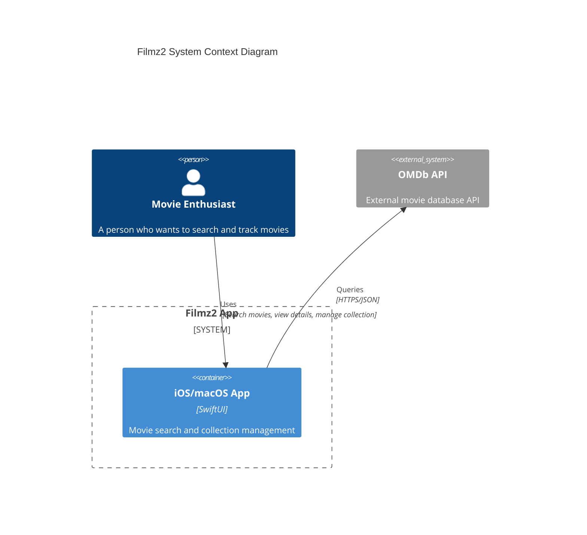
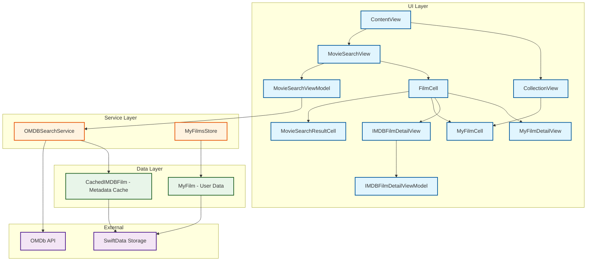
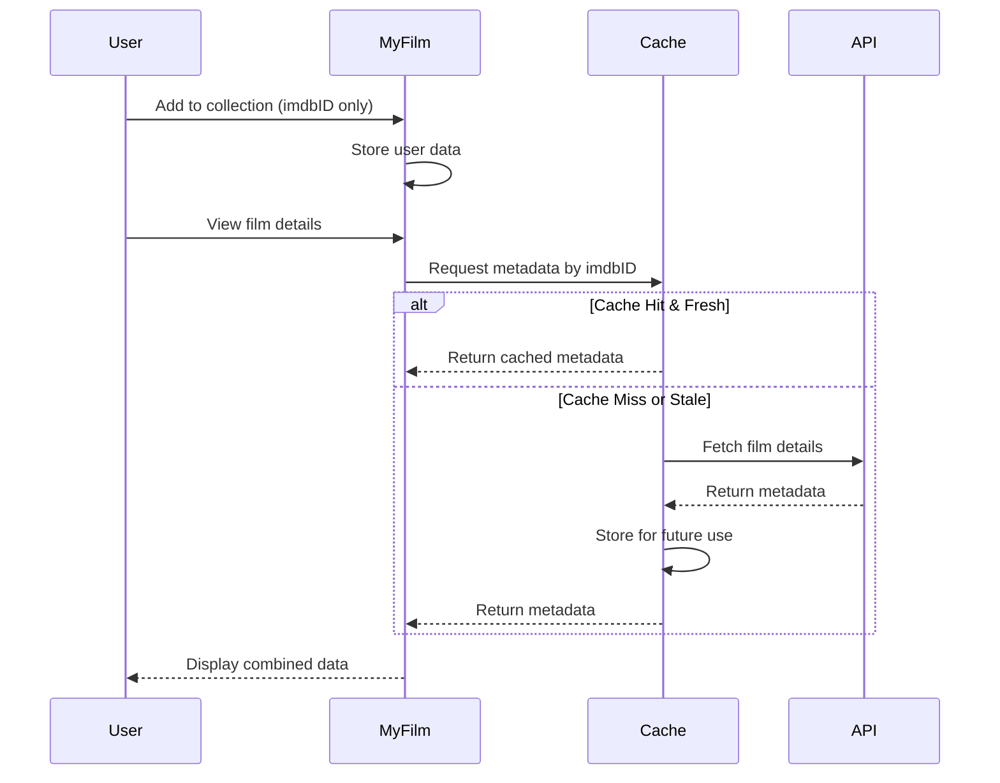
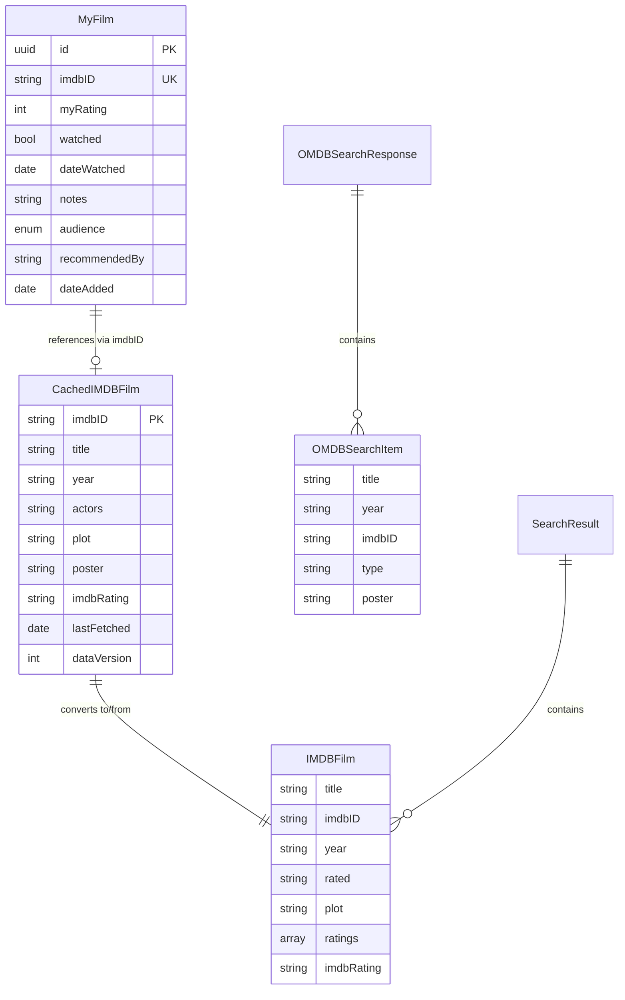
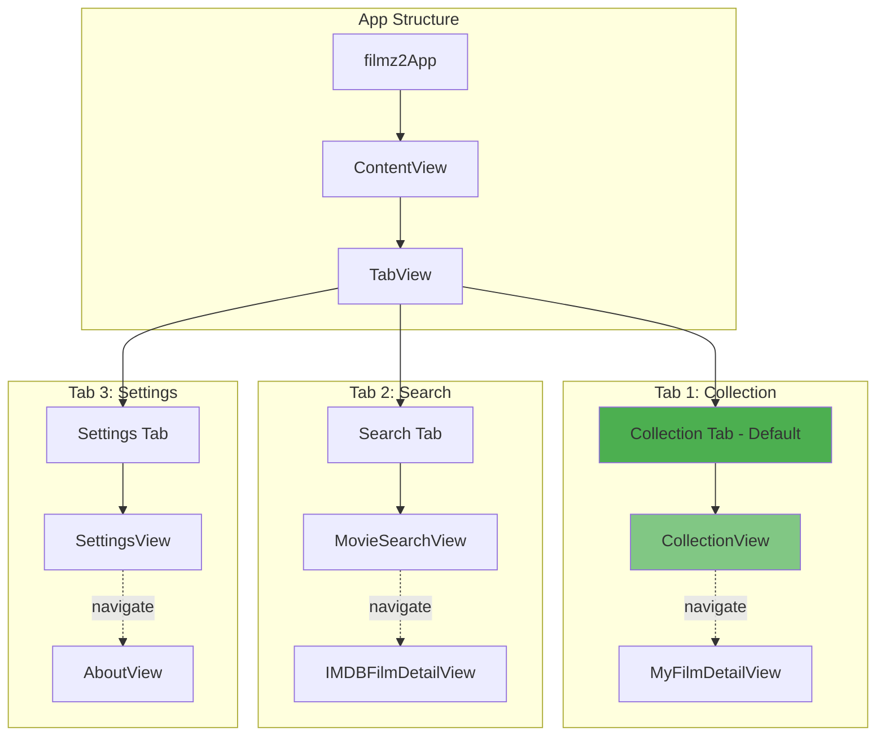
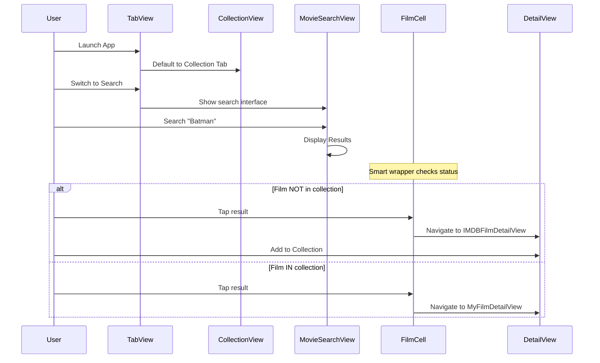
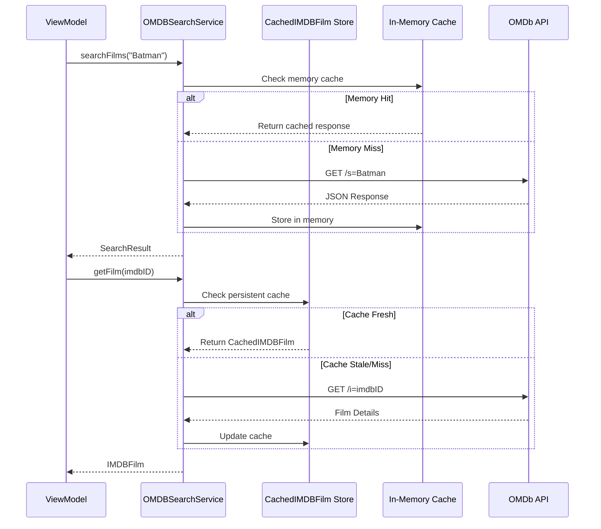
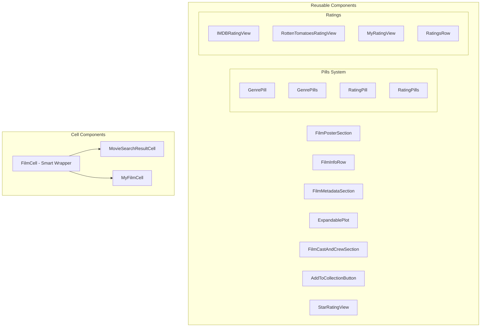
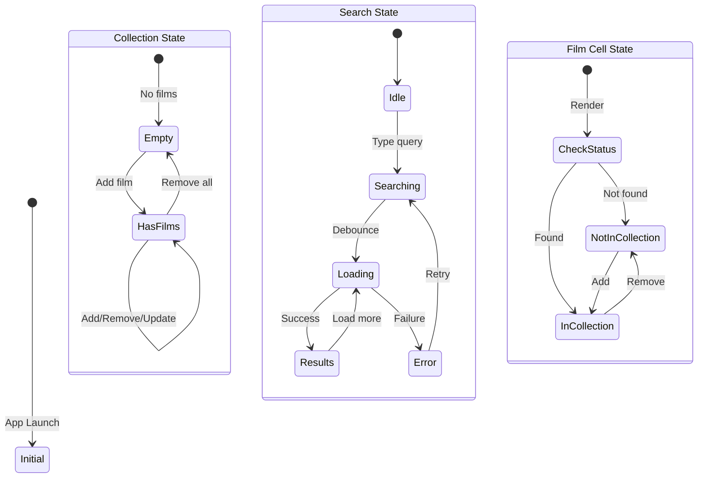
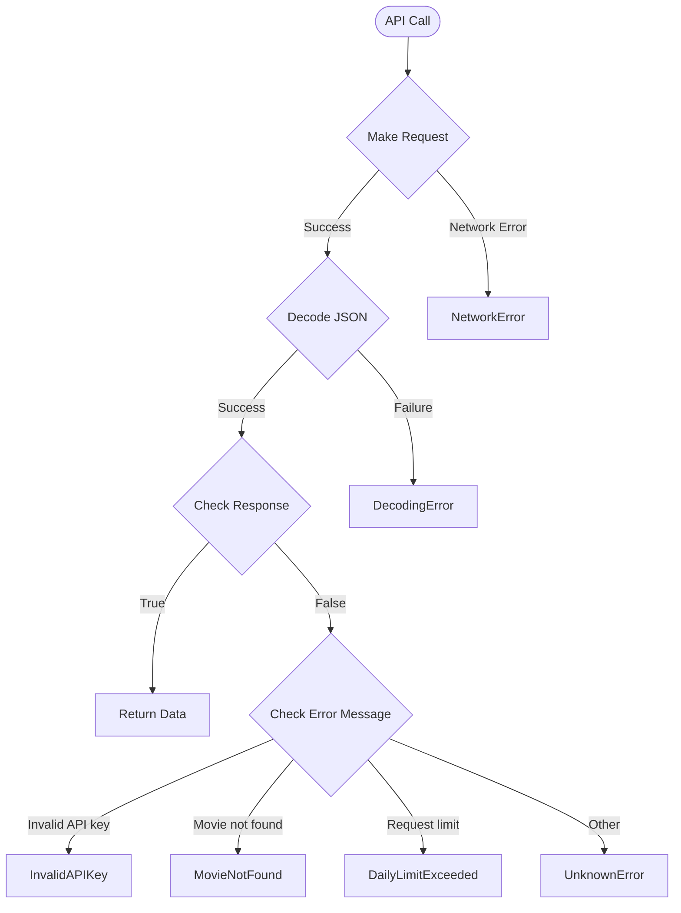

# ARCHITECTURE

[TOC]

## Overview

Filmz2 is a movie collection management app built with SwiftUI and SwiftData. It allows users to search for movies using the OMDb API, view detailed information, and maintain a personal collection with ratings, watch status, and notes.

### Key Features

- Movie search with real-time results from OMDb API
- Detailed film information display
- Personal collection management
- Offline capability with intelligent caching
- Watch status and personal ratings tracking
- Clean, native iOS/macOS interface

## System Overview



## High-Level Architecture

The app follows a layered architecture with clear separation of concerns:



### Architecture Layers

1. **UI Layer**: SwiftUI views and view models implementing MVVM pattern
2. **Service Layer**: Business logic and API communication
3. **Data Layer**: Models and persistence using SwiftData
4. **External Layer**: Third-party services and system storage

## Core Architecture Pattern: ID-Only with Cached Metadata

Filmz2 uses an innovative ID-only architecture pattern where user data (MyFilm) only stores the IMDB ID reference, while film metadata is cached separately (CachedIMDBFilm). This provides several key benefits:

### Benefits

- **No Data Duplication**: Each film's metadata is stored exactly once
- **Offline Access**: Cached data enables full functionality without internet
- **Smart API Usage**: Cache-first approach minimizes API calls
- **Clean Separation**: User data is clearly separated from movie metadata
- **Future-Ready**: Enables features like shared collections or social features
- **Efficient Storage**: Smaller footprint for user collections

### How It Works

1. User adds a film to collection → MyFilm created with just imdbID
2. Film details needed → Check CachedIMDBFilm first
3. Cache miss or stale → Fetch from OMDb API and cache
4. Display film → Combine MyFilm (user data) + CachedIMDBFilm (metadata)



## Data Model Architecture

### Model Relationships



### Key Models

1. **MyFilm**: Stores user-specific data (ratings, notes, watch status)
2. **CachedIMDBFilm**: Persistent cache of movie metadata from API
3. **IMDBFilm**: Runtime model for displaying film details
4. **OMDBSearchItem**: Search result from API

## Navigation Architecture

### Tab-Based Navigation Structure



### Navigation Flow



## Service Layer Details

### OMDBSearchService

The core service for interacting with the OMDb API with intelligent caching.

**Key Features:**

- Search films by title with pagination
- Get detailed film information by IMDB ID
- Persistent caching using CachedIMDBFilm
- Cache-first approach with 30-day freshness
- Automatic retry and error handling
- In-memory response caching

**Architecture:**



### MyFilmsStore

Manages the user's personal film collection with reactive updates.

**Key Features:**

- CRUD operations for user's collection
- Real-time statistics (total, watched, unwatched)
- Duplicate prevention
- SwiftUI integration with @Published
- Automatic UI updates

## UI Component Architecture

### Component Hierarchy



### FilmCell - The Smart Wrapper Pattern

A unified component that intelligently displays films based on collection status:

```text
FilmCell (Wrapper Component)
  ├── Checks: Is film in user's collection?
  ├── If YES → Renders: MyFilmCell
  │   └── Shows: Personal data (rating, watched status)
  │   └── Navigates to: MyFilmDetailView
  ├── If NO → Renders: MovieSearchResultCell
  │   └── Shows: Basic info + "Add to Collection" button
  │   └── Navigates to: IMDBFilmDetailView
  └── Provides: Consistent layout across both states
```

## State Management

### Reactive State Flow



### Data Flow

1. **User Action** → View captures input
2. **View** → Updates ViewModel via binding
3. **ViewModel** → Calls Service layer
4. **Service** → Updates Model/Makes API call
5. **Model** → Notifies observers
6. **View** → Re-renders with new data

## API Integration

### OMDb API Details

**Base URL**: `http://www.omdbapi.com/`  
**Poster URL**: `http://img.omdbapi.com/`

**Key Endpoints:**

- Search: `/?s={title}&page={page}`
- Details: `/?i={imdbID}`
- By Title: `/?t={title}&y={year}`

**Error Handling:**



## Performance Considerations

### Caching Strategy

1. **In-Memory Cache**: Immediate response for repeated searches
2. **Persistent Cache**: 30-day freshness for offline access
3. **Lazy Loading**: Images loaded asynchronously
4. **Debounced Search**: 500ms delay prevents excessive API calls

### SwiftData Optimization

- Efficient queries using predicates
- Batch operations where possible
- Minimal model complexity for MyFilm
- Separate cache model for metadata

## Testing Architecture

### Test Structure

```text
filmz2Tests/
├── Services/
│   ├── OMDBSearchServiceTests
│   └── MyFilmsManagerTests
├── ViewModels/
│   ├── MovieSearchViewModelTests
│   └── IMDBFilmDetailViewModelTests
└── UI/
    └── MovieSearchUITests
```

### Testing Approach

- Unit tests for services with mocked URLSession
- ViewModel tests with mock services
- UI tests for critical user flows
- SwiftData tests using in-memory stores

## Future Extensibility

The architecture supports future enhancements:

1. **Social Features**: ID-only pattern enables sharing collections
2. **Multiple Lists**: Extend MyFilm with list relationships
3. **Recommendations**: Add recommendation engine using cached data
4. **Export/Import**: Simple with separated user data
5. **Analytics**: Track viewing patterns from MyFilm data

## Summary

Filmz2's architecture prioritizes:

- **Separation of Concerns**: Clear layer boundaries
- **Offline First**: Comprehensive caching strategy
- **User Experience**: Reactive UI with immediate feedback
- **Maintainability**: Consistent patterns and components
- **Performance**: Efficient data storage and API usage

The ID-only pattern with cached metadata provides an elegant solution for managing user collections while maintaining data integrity and enabling offline functionality.
