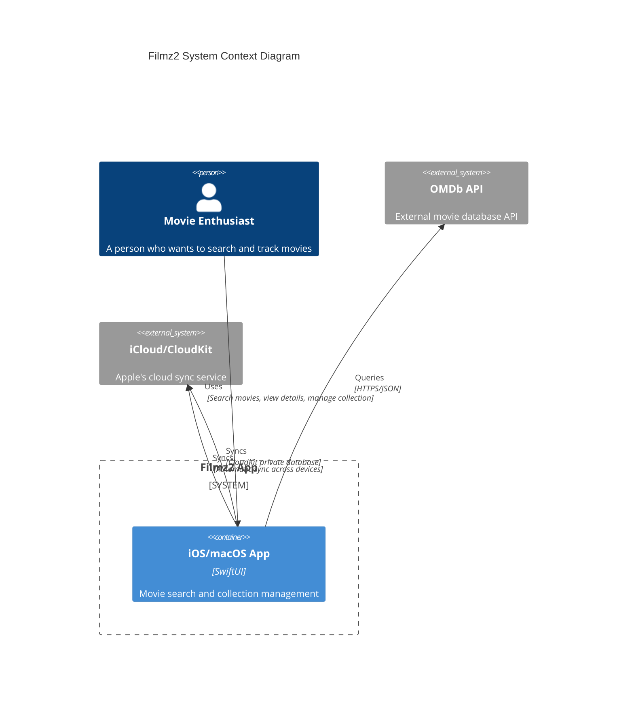
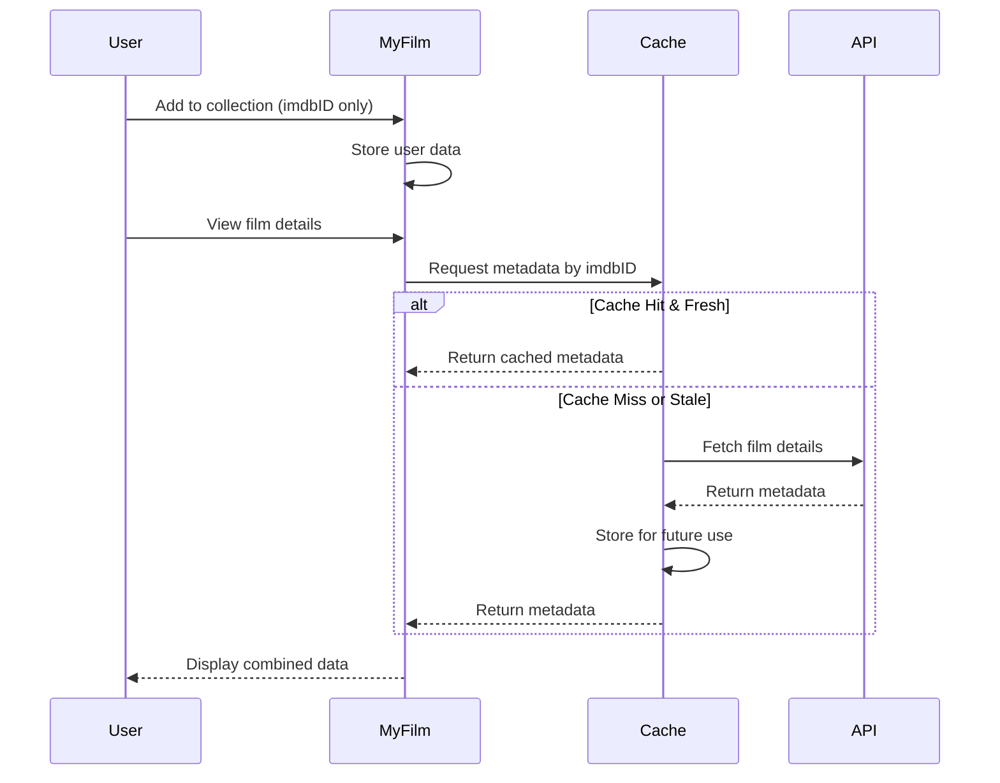
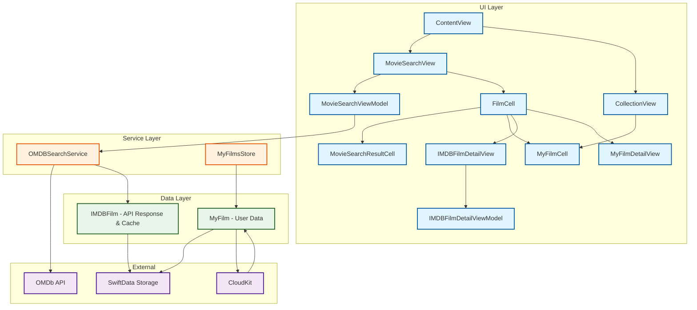
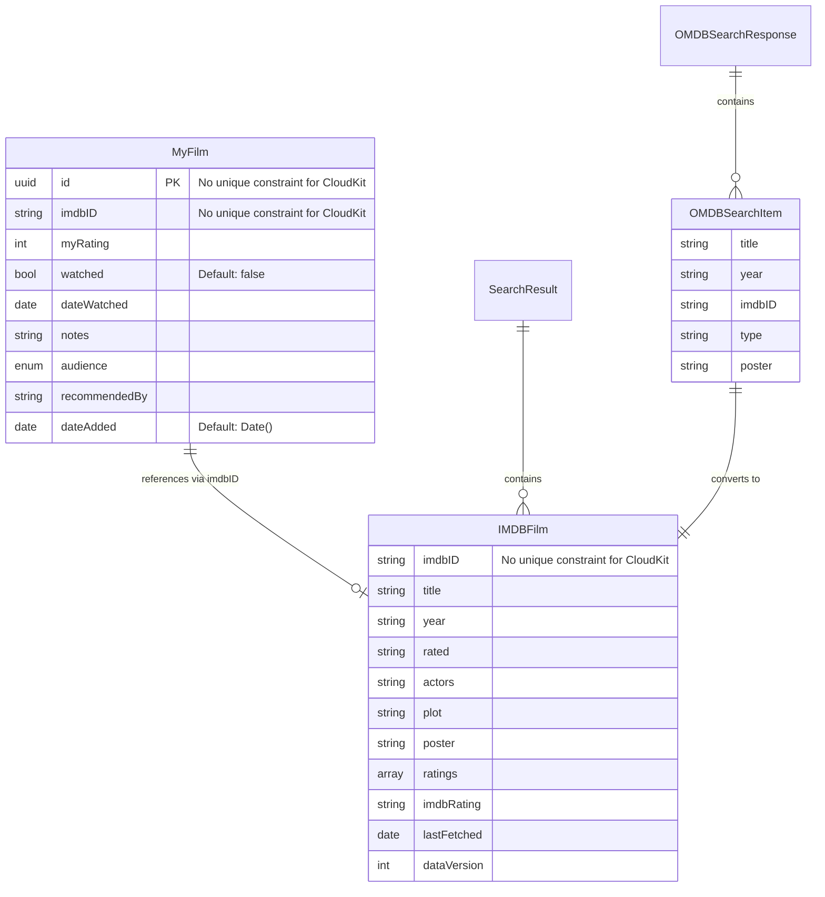
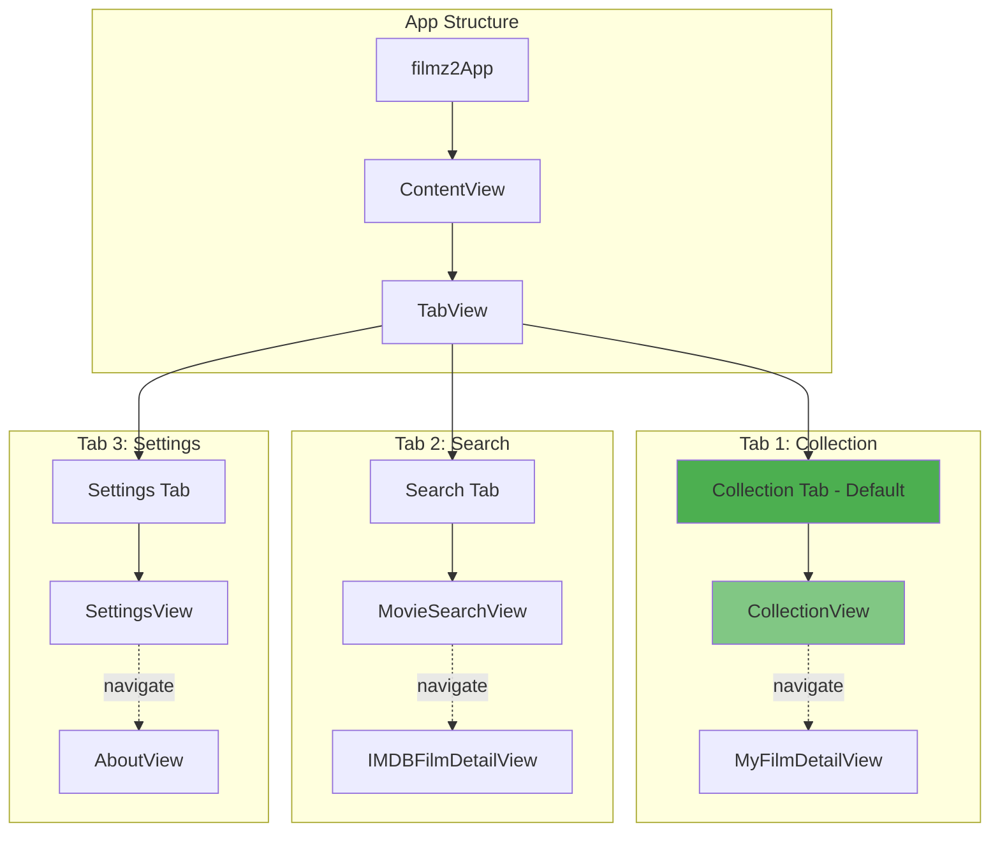
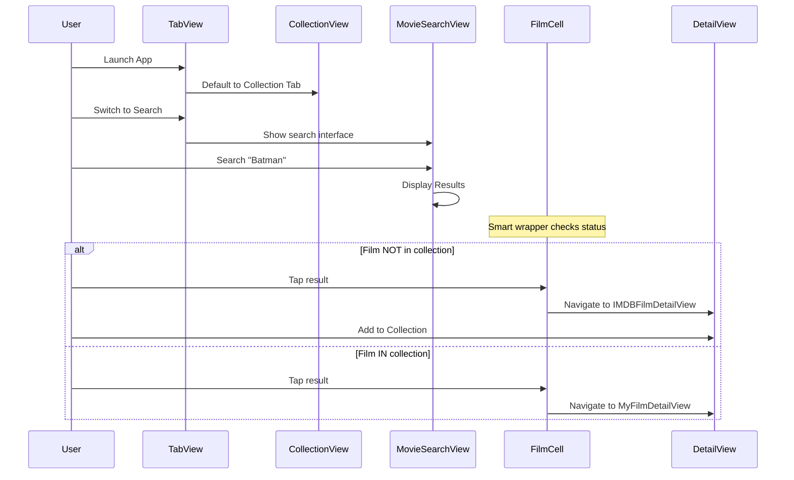
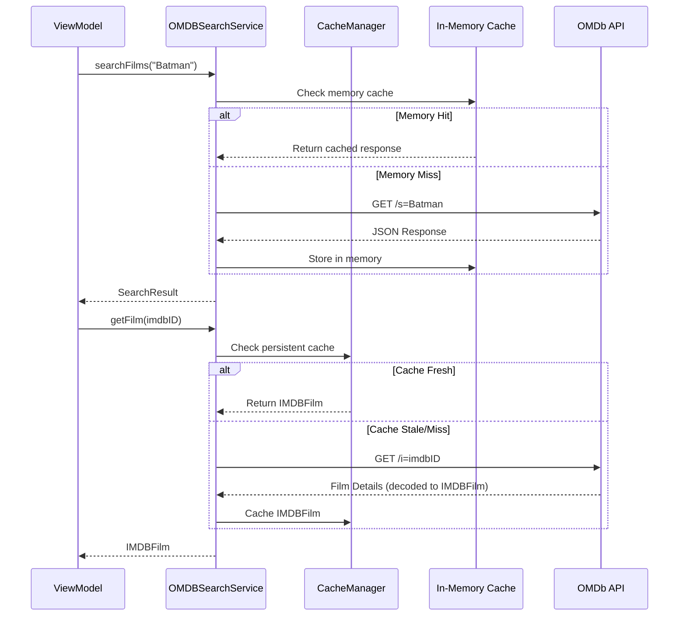
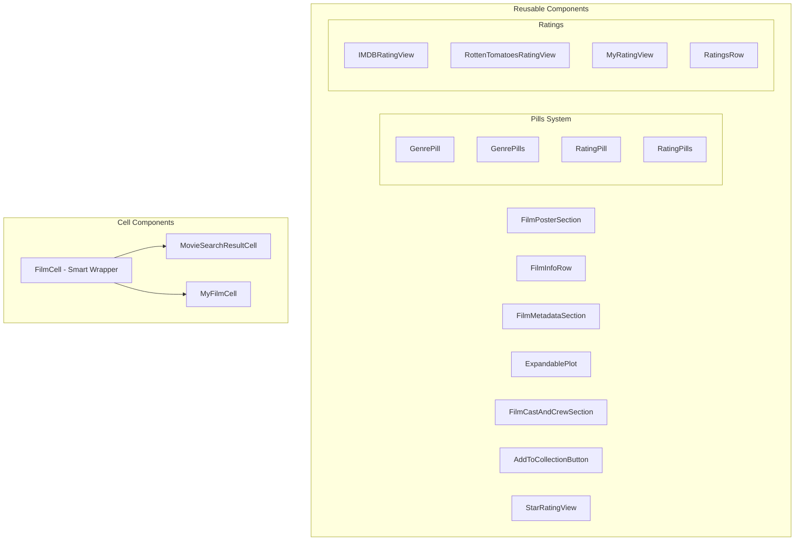
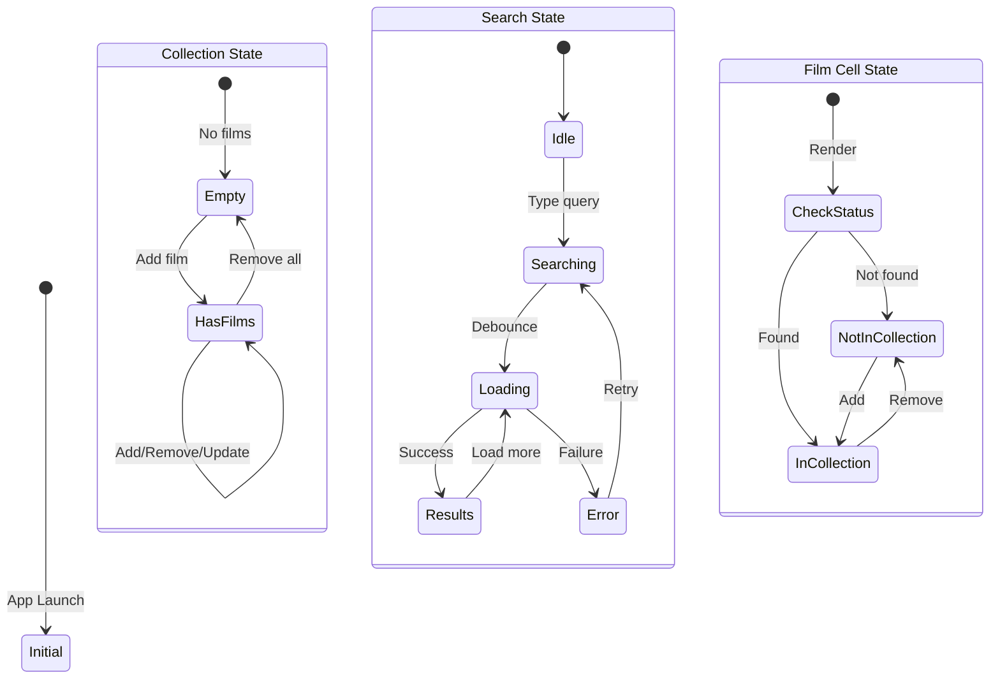
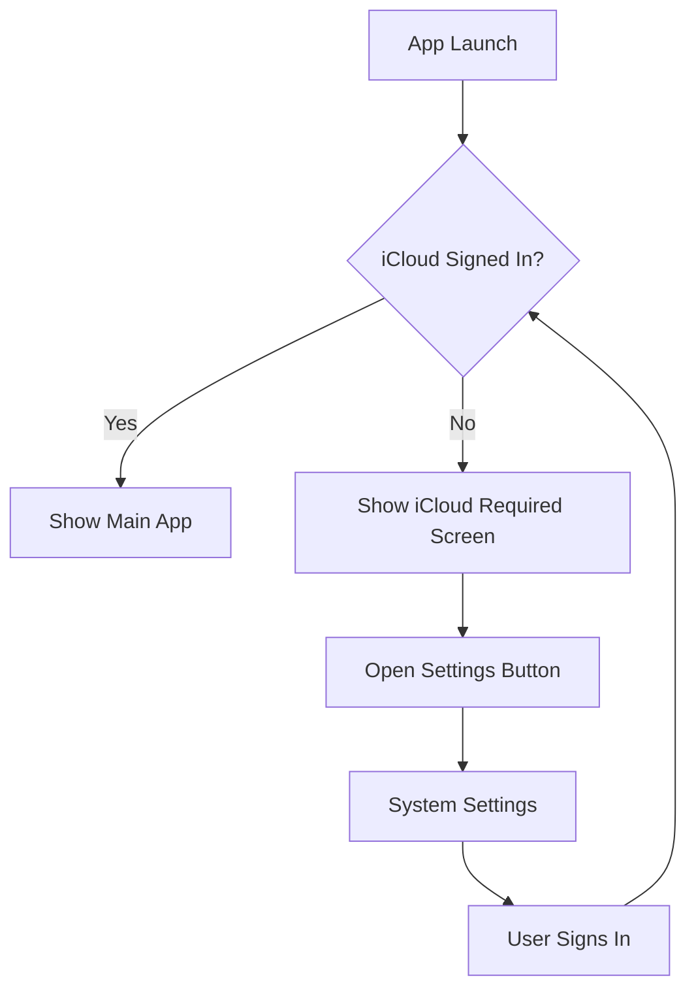

# ARCHITECTURE

[TOC]

## Overview

Filmz2 is a movie collection management app built with SwiftUI and SwiftData. It allows users to search for movies using the OMDb API, view detailed information, and maintain a personal collection with ratings, watch status, and notes.

### Key Features

- Movie search with real-time results from OMDb API
- Detailed film information display
- Personal collection management with automatic iCloud sync
- Offline capability with intelligent caching
- Watch status and personal ratings tracking
- Clean, native iOS/macOS interface
- Seamless multi-device synchronization via CloudKit

## System Overview



## Core Architecture Pattern: ID-Only with Cached Metadata

Filmz2 uses an ID-only architecture pattern where user data (MyFilm) only stores the IMDB ID reference, while film metadata is cached separately using IMDBFilm as both API response and persistent cache model. This provides several key benefits:

### Benefits

- **No Data Duplication**: Each film's metadata is stored exactly once
- **Offline Access**: Cached data enables full functionality without internet
- **Smart API Usage**: Cache-first approach minimizes API calls
- **Clean Separation**: User data is clearly separated from movie metadata
- **Future-Ready**: Enables features like shared collections or social features
- **Efficient Storage**: Smaller footprint for user collections

### How It Works

1. User adds a film to collection → MyFilm created with just imdbID
2. Film details needed → Check cached IMDBFilm first
3. Cache miss or stale → Fetch from OMDb API, decode to IMDBFilm, and cache
4. Display film → Combine MyFilm (user data) + IMDBFilm (metadata)



## High-Level Architecture

The app follows a layered architecture with clear separation of concerns:



### Architecture Layers

1. **UI Layer**: SwiftUI views and view models implementing MVVM pattern
2. **Service Layer**: Business logic and API communication
3. **Data Layer**: Models and persistence using SwiftData
4. **External Layer**: Third-party services and system storage

## Data Model Architecture

### Model Relationships



### Key Models

1. **MyFilm**: Stores user-specific data (ratings, notes, watch status) - Synced via CloudKit
2. **IMDBFilm**: Unified model serving as both API response decoder and persistent cache - Local only
3. **OMDBSearchItem**: Search result from API (converted to IMDBFilm for detail views)

### Model Consolidation Architecture

**Design Decision**: IMDBFilm serves dual purposes as both API response decoder and persistent cache model.

**Benefits of Consolidation**:

- **Simplified Architecture**: Single model instead of separate API and cache models
- **No Data Conversion**: Eliminates transformation between CachedIMDBFilm and IMDBFilm
- **Unified Lifecycle**: API responses directly cached without intermediate steps
- **CloudKit Compatible**: No unique constraints, manual uniqueness handling in CacheManager
- **Reduced Complexity**: Fewer model types to maintain and test

**Implementation Details**:

- **SwiftData @Model**: IMDBFilm is a SwiftData-managed class for persistence
- **Codable Conformance**: Custom encode/decode for API communication
- **Cache Metadata**: Built-in lastFetched and dataVersion fields for staleness detection
- **Manual Uniqueness**: CacheManager handles duplicate prevention (CloudKit requirement)

### CloudKit Considerations

All models must be CloudKit-compatible:

- No unique constraints allowed
- All non-optional properties must have default values
- Single model container for simplicity

## Navigation Architecture

### Tab-Based Navigation Structure



### Navigation Flow



## Services

### OMDBSearchService

The core service for interacting with the OMDb API with intelligent caching.

**Key Features:**

- Search films by title with pagination
- Get detailed film information by IMDB ID
- Persistent caching using IMDBFilm model
- Cache-first approach with 30-day freshness
- Automatic retry and error handling
- In-memory response caching

**Architecture:**



### MyFilmsStore

Manages the user's personal film collection with reactive updates.

**Key Features:**

- CRUD operations for user's collection
- Real-time statistics (total, watched, unwatched)
- Duplicate prevention
- SwiftUI integration with @Published
- Automatic UI updates

## Swift Concurrency and Sendable Compliance

### The Challenge

Swift 6's strict concurrency model introduces Sendable requirements that create challenges when working with SwiftData models. The core issue is that SwiftData's `@Model` classes are inherently non-Sendable because they:

- Contain mutable state managed by SwiftData
- Use internal synchronization mechanisms
- Cannot be safely passed across actor boundaries without explicit handling

### Our Solution: ModelActor Pattern

Filmz2 uses SwiftData's `ModelActor` pattern to handle all database operations safely across concurrent environments. The `ModelActor` protocol provides a dedicated actor context for performing SwiftData operations on background queues while maintaining thread safety.

### What is ModelActor?

`ModelActor` is a protocol that conforms to Swift's `Actor` protocol, providing isolated access to a `ModelContext`. When you create a custom actor that conforms to `ModelActor`, SwiftData automatically provides the necessary infrastructure for safe concurrent database operations.

### Key Features

- **Automatic ModelContext Management**: SwiftData automatically creates and manages a `ModelContext` instance for your actor
- **Thread Safety**: All operations are automatically serialized, preventing data races
- **Background Processing**: Perfect for performing heavy database operations without blocking the main thread

### Implementation

```swift
@ModelActor
actor FilmCacheActor {
    func fetchFilm(imdbID: String) throws -> IMDBFilm? {
        let descriptor = FetchDescriptor<IMDBFilm>(
            predicate: #Predicate { $0.imdbID == imdbID }
        )
        return try modelContext.fetch(descriptor).first
    }

    func saveFilm(_ film: IMDBFilm) throws {
        modelContext.insert(film)
        try modelContext.save()
    }

    func fetchAllFilms() throws -> [IMDBFilm] {
        let descriptor = FetchDescriptor<IMDBFilm>()
        return try modelContext.fetch(descriptor)
    }
}
```

### Usage Pattern

```swift
// Create the actor instance
let cacheActor = FilmCacheActor(modelContainer: container)

// Use in service layer
class OMDBSearchService {
    private let cacheActor: FilmCacheActor

    func getFilm(byID: String) async throws -> IMDBFilm {
        // Check actor-managed cache first
        if let cached = try await cacheActor.fetchFilm(imdbID: byID) {
            return cached
        }

        // Fetch from API
        let film = try await fetchFromAPI(byID)

        // Save through actor
        try await cacheActor.saveFilm(film)

        return film
    }
}
```

### Benefits

- **Best Practice Compliance**: Follows Apple's recommended SwiftData concurrency patterns
- **True Thread Safety**: Provides genuine actor isolation without compiler workarounds
- **Automatic Isolation**: No need to manually manage thread safety
- **Simplified Error Handling**: Clean async/await error handling
- **Better Performance**: Background operations don't block UI
- **Memory Management**: SwiftData handles ModelContext lifecycle automatically
- **Scalability**: Handles background operations efficiently as the app grows
- **Clean Architecture**: Separates database concerns from service logic

## UI Component Architecture

### Component Hierarchy



### FilmCell - The Smart Wrapper Pattern

A unified component that intelligently displays films based on collection status:

```text
FilmCell (Wrapper Component)
  ├── Checks: Is film in user's collection?
  ├── If YES → Renders: MyFilmCell
  │   └── Shows: Personal data (rating, watched status)
  │   └── Navigates to: MyFilmDetailView
  └── If NO → Renders: MovieSearchResultCell
      └── Shows: Basic info + "Add to Collection" button
      └── Navigates to: IMDBFilmDetailView
```

## State Management

### Reactive State Flow



### Data Flow

1. **User Action** → View captures input
2. **View** → Updates ViewModel via binding
3. **ViewModel** → Calls Service layer
4. **Service** → Updates Model/Makes API call
5. **Model** → Notifies observers
6. **View** → Re-renders with new data

## API Integration

### OMDb API Details

**Base URL**: `http://www.omdbapi.com/`  
**Poster URL**: `http://img.omdbapi.com/`

**Key Endpoints:**

- Search: `/?s={title}&page={page}`
- Details: `/?i={imdbID}`
- By Title: `/?t={title}&y={year}`

**Error Handling:**


## CloudKit Integration and iCloud Requirement

Filmz2 **requires** iCloud sign-in as a core architectural decision. This approach, inspired by the original filmz project, eliminates complexity and provides a seamless user experience.

### Key Principles

1. **Mandatory iCloud**: Users must be signed into iCloud to use the app
2. **Automatic Sync**: No manual sync controls or status indicators
3. **Zero Configuration**: Works automatically across all devices
4. **Seamless Experience**: No sync UI - the app just works

### Architecture Benefits

- **Simplicity**: No need to handle offline/online states differently
- **Consistency**: All devices always have the same data
- **Reliability**: Apple handles sync conflicts automatically
- **Privacy**: Data stored in user's private CloudKit database

### Implementation Details

```swift
// SwiftData configuration with CloudKit
let syncedConfiguration = ModelConfiguration(
    schema: syncedSchema,
    isStoredInMemoryOnly: false,
    cloudKitDatabase: .private("iCloud.com.grtnr.filmz2")
)
```

The app uses separate model configurations:

- **MyFilm**: Synced via CloudKit (user's collection data)
- **IMDBFilm**: Local only (movie metadata cache and API response model)

### iCloud Check Flow



## CloudKit Access and Configuration

### Prerequisites and Requirements

#### User Requirements

1. **iCloud Account**: User must be signed into iCloud on their device
2. **iCloud Drive**: Must be enabled in device settings
3. **Storage Quota**: Sufficient iCloud storage available (MyFilm data is minimal ~1KB per film)
4. **Network Access**: Initial sync requires internet connection

#### Developer Requirements

1. **Apple Developer Account**: Required for CloudKit capabilities
2. **Provisioning Profiles**: Must include CloudKit entitlements
3. **Bundle Identifier**: Must match CloudKit container ID

### Project Configuration

#### 1. Xcode Capabilities

Enable the following capabilities in your app target:

1. **iCloud**

   - ✓ CloudKit
   - ✓ Use default container or specify custom

2. **Push Notifications** (Required for CloudKit sync)
   - Automatically enabled with CloudKit

#### 2. Entitlements File

The `filmz2.entitlements` file must contain:

```xml
<?xml version="1.0" encoding="UTF-8"?>
<!DOCTYPE plist PUBLIC "-//Apple//DTD PLIST 1.0//EN" "http://www.apple.com/DTDs/PropertyList-1.0.dtd">
<plist version="1.0">
<dict>
    <!-- Push notifications for CloudKit sync -->
    <key>aps-environment</key>
    <string>development</string>

    <!-- CloudKit container identifier -->
    <key>com.apple.developer.icloud-container-identifiers</key>
    <array>
        <string>iCloud.com.grtnr.filmz2</string>
    </array>

    <!-- Enable CloudKit services -->
    <key>com.apple.developer.icloud-services</key>
    <array>
        <string>CloudKit</string>
    </array>
</dict>
</plist>
```

#### 3. Info.plist Configuration

Add usage descriptions for user transparency:

```xml
<key>NSUbiquitousContainers</key>
<dict>
    <key>iCloud.com.grtnr.filmz2</key>
    <dict>
        <key>NSUbiquitousContainerName</key>
        <string>Filmz2 Collection</string>
        <key>NSUbiquitousContainerIsDocumentScopePublic</key>
        <false/>
    </dict>
</dict>
```

### CloudKit Dashboard Configuration

#### 1. Container Setup

1. Navigate to [CloudKit Dashboard](https://icloud.developer.apple.com/dashboard)
2. Select or create container: `iCloud.com.grtnr.filmz2`
3. Environment: Development → Production promotion flow

#### 2. Record Types

SwiftData automatically creates record types, but understanding them helps with debugging:

- **CD_MyFilm**: User's film collection data
  - Fields map to MyFilm properties
  - Indexed on: modifiedAt, recordName

#### 3. Security Roles

Default security for private database:

- **Owner**: Read/Write (automatic for user's own data)
- **No public access**: All data in private database

### Access Control and Error Handling

#### iCloud Status Checking

```swift
// Check iCloud availability
func checkiCloudStatus() -> Bool {
    if FileManager.default.ubiquityIdentityToken != nil {
        return true // iCloud is available
    } else {
        return false // User not signed in
    }
}
```

#### Common Access Errors

1. **CKError.notAuthenticated**

   - User not signed into iCloud
   - Solution: Show ICloudRequiredView

2. **CKError.quotaExceeded**

   - User's iCloud storage is full
   - Solution: Alert user to manage storage

3. **CKError.networkUnavailable**

   - No internet connection
   - Solution: Queue changes for later sync

4. **CKError.serverResponseLost**
   - Sync interrupted
   - Solution: Automatic retry by SwiftData

### Privacy and Data Access

#### Data Location

- **Private Database**: All user data stored in their private CloudKit database
- **No Shared Database**: No data sharing between users
- **No Public Database**: No publicly accessible data

#### Data Encryption

- **In Transit**: TLS encryption for all CloudKit communication
- **At Rest**: Encrypted on Apple's servers
- **End-to-End**: User's data accessible only with their iCloud credentials

#### GDPR and Privacy Compliance

- **Data Ownership**: User owns all their data
- **Data Portability**: Export functionality available
- **Right to Delete**: Deleting app removes all CloudKit data
- **No Analytics**: No user data collected by developer

### Troubleshooting Common Issues

#### 1. "Sign in to iCloud" Despite Being Signed In

**Cause**: App-specific iCloud permissions
**Solution**:

- Settings → Apple ID → iCloud → Apps Using iCloud → Enable Filmz2

#### 2. Sync Not Working

**Checklist**:

- ✓ iCloud Drive enabled
- ✓ Sufficient storage available
- ✓ Network connection active
- ✓ Not in Low Power Mode
- ✓ Background App Refresh enabled

#### 3. Development vs Production

**Development**:

- Separate CloudKit database
- Reset development data: CloudKit Dashboard → Reset Development Environment

**Production**:

- Deploy schema to production before app release
- No reset available - careful with schema changes

### Testing CloudKit Access

#### Unit Tests

```swift
// Mock iCloud availability
class MockFileManager: FileManager {
    var mockUbiquityToken: Any? = "mock-token"

    override var ubiquityIdentityToken: Any? {
        return mockUbiquityToken
    }
}
```

#### UI Tests

```swift
// Test iCloud required flow
func testICloudRequiredView() {
    // Mock no iCloud
    // Verify ICloudRequiredView appears
    // Test "Open Settings" button
}
```

### CloudKit Design Decisions

1. **Mandatory iCloud**: Simplifies architecture by eliminating sync state management
2. **Private Database Only**: Ensures user privacy and automatic authentication
3. **No Sync UI**: Follows the philosophy that sync should be invisible to users
4. **Single Model Container**: All models in one container for simplicity, even though only MyFilm syncs

## Performance Considerations

### Caching Strategy

1. **In-Memory Cache**: Immediate response for repeated searches
2. **Persistent Cache**: 30-day freshness for offline access
3. **Lazy Loading**: Images loaded asynchronously
4. **Debounced Search**: 500ms delay prevents excessive API calls

### SwiftData Optimization

- Efficient queries using predicates
- Batch operations where possible
- Minimal model complexity for MyFilm
- Separate cache model for metadata

## Testing Architecture

### Test Structure

```text
filmz2Tests/
├── Services/
│   ├── OMDBSearchServiceTests
│   └── MyFilmsManagerTests
├── ViewModels/
│   ├── MovieSearchViewModelTests
│   └── IMDBFilmDetailViewModelTests
└── UI/
    └── MovieSearchUITests
```

### Testing Approach

- Unit tests for services with mocked URLSession
- ViewModel tests with mock services
- UI tests for critical user flows
- SwiftData tests using in-memory stores

## Future Extensibility

The architecture supports future enhancements:

1. **Social Features**: ID-only pattern enables sharing collections
2. **Multiple Lists**: Extend MyFilm with list relationships
3. **Recommendations**: Add recommendation engine using cached data
4. **Export/Import**: Simple with separated user data
5. **Analytics**: Track viewing patterns from MyFilm data

## Summary

Filmz2's architecture prioritizes:

- **Separation of Concerns**: Clear layer boundaries
- **Offline First**: Comprehensive caching strategy
- **User Experience**: Reactive UI with immediate feedback
- **Maintainability**: Consistent patterns and components
- **Performance**: Efficient data storage and API usage
- **Seamless Sync**: Mandatory iCloud with automatic CloudKit synchronization

The ID-only pattern with cached metadata provides an elegant solution for managing user collections while maintaining data integrity and enabling offline functionality. The mandatory iCloud requirement ensures a seamless, zero-configuration experience across all user devices.
