# ARCHITECTURE

[TOC]

## Architecture Pattern: ID-Only with Cached Metadata

Filmz2 uses an ID-only architecture pattern where user data (MyFilm) only stores the IMDB ID reference, while film metadata is cached separately (CachedIMDBFilm). This provides several key benefits:

**Benefits:**

- **No Data Duplication**: Each film's metadata is stored exactly once
- **Offline Access**: Cached data enables full functionality without internet
- **Smart API Usage**: Cache-first approach minimizes API calls
- **Clean Separation**: User data is clearly separated from movie metadata
- **Future-Ready**: Enables features like shared collections or social features
- **Efficient Storage**: Smaller footprint for user collections

**How It Works:**

1. User adds a film to collection → MyFilm created with just imdbID
2. Film details needed → Check CachedIMDBFilm first
3. Cache miss or stale → Fetch from OMDB API and cache
4. Display film → Combine MyFilm (user data) + CachedIMDBFilm (metadata)

## System Overview


## Structure

The main elements of our application:

- OMDBSearchService: Service that searches films using the OMDb API with persistent caching
  - Checks CachedIMDBFilm store before making API calls
  - Automatically caches responses for offline access
  - 30-day cache freshness policy
- MyFilmsStore: Service that manages the user's film collection using SwiftData for local persistence. Provides CRUD operations, filtering, and statistics.
- UI:
  - MovieSearchView: The main search interface where users search for films. Contains a search field with debouncing, results list with movie posters and metadata.
    - MovieSearchViewModel: Manages search state, API calls, and pagination
    - FilmCell: Smart wrapper component that displays films based on collection status
      - MovieSearchResultCell: Displays search results not in collection
      - MyFilmCell: Displays films from user's collection with rich metadata
  - IMDBFilmDetailView: Shows detailed information about a selected film from search results, includes add to collection functionality
  - CollectionView: Displays the user's film collection with tabs for All/Watched/Unwatched films
    - MyFilmCell: Shows films in the collection with poster, title, year, and watch status
  - MyFilmDetailView: Viewing and editing the details of a user's film: watch status, rating, notes, and audience type (fetches film metadata asynchronously)

### High-Level Architecture


### Component Dependencies


## Data Model Relationships


## Services

### OMDBSearchService

Allows us to search films in the OMDb API with intelligent caching. We use this service to get IMDB-type information about movies, including the IMDB ID.

**Key Features:**

- Search films by title with pagination support
- Get detailed film information by IMDB ID or title
- Persistent caching using CachedIMDBFilm model
- Cache-first approach: checks local storage before API
- 30-day cache freshness policy
- Automatic cache population when films are added to collection
- Debounced search to prevent excessive API calls
- Error handling for network issues, API limits, and invalid responses
- In-memory response caching for immediate re-use

**Protocol Methods:**

- `searchFilms(query:year:type:page:)` - Returns structured SearchResult
- `searchFilmsRaw(query:year:type:page:)` - Returns raw OMDBSearchResponse
- `getFilm(byID:)` - Get film details by IMDB ID
- `getFilm(byTitle:year:)` - Get film details by title
- `getFilmDetails(imdbID:)` - Convenience method for getting details

#### Service Interaction Flow


#### Error Handling Flow


#### Technical

The OMDB API is located at the [OMDb API documentation](https://www.omdbapi.com). For data requests (i.e. search requests) we use `http://www.omdbapi.com/?apikey=[yourkey]&`. For requesting posters we use `http://img.omdbapi.com/?apikey=[yourkey]&`.

When searching we get a list of films within a JSON. An example would be:

```JSON
{
  "Title": "Mission: Impossible - The Final Reckoning",
  "Year": "2025",
  "Rated": "N/A",
  "Released": "23 May 2025",
  "Runtime": "169 min",
  "Genre": "Action, Adventure, Thriller",
  "Director": "Christopher McQuarrie",
  "Writer": "Bruce Geller, Erik Jendresen, Christopher McQuarrie",
  "Actors": "Vanessa Kirby, Tom Cruise, Hayley Atwell",
  "Plot": "Our lives are the sum of our choices. Tom Cruise is Ethan Hunt in Mission: Impossible - The Final Reckoning.",
  "Language": "English",
  "Country": "United States, United Kingdom",
  "Awards": "1 nomination total",
  "Poster": "https://m.media-amazon.com/images/M/MV5BZGQ5NGEyYTItMjNiMi00Y2EwLTkzOWItMjc5YjJiMjMyNTI0XkEyXkFqcGc@._V1_SX300.jpg",
  "Ratings": [{ "Source": "Rotten Tomatoes", "Value": "79%" }],
  "Metascore": "N/A",
  "imdbRating": "N/A",
  "imdbVotes": "N/A",
  "imdbID": "tt9603208",
  "Type": "movie",
  "DVD": "N/A",
  "BoxOffice": "N/A",
  "Production": "N/A",
  "Website": "N/A",
  "Response": "True"
}
```

See the [OMDb API example JSON file](OMDb_API_example.json).
Note: Not all the fields are relevant to us.

The description of the search parameters is available at [OMDb API search parameters](https://www.omdbapi.com/#parameters).

### MyFilmsStore

Manages the user's personal film collection using SwiftData for persistence. This service provides a reactive interface for collection management with automatic UI updates.

**Key Features:**

- CRUD operations for user's film collection
- Real-time collection statistics (total, watched, unwatched counts)
- Automatic film detail caching when adding to collection
- Duplicate detection to prevent adding same film twice
- @Published properties for SwiftUI integration
- Error handling with descriptive error types

**Architecture Role:**

- Single source of truth for user's collection
- Manages MyFilm entities (ID-only pattern)
- Coordinates with OMDBSearchService for caching
- Provides environment value for app-wide access

**Key Methods:**

- `addFilm(from:)` - Add film from search result or detailed view
- `updateFilm(_:)` - Update user data (rating, notes, etc.)
- `deleteFilm(_:)` - Remove from collection
- `getFilm(by:)` - Find film by IMDB ID
- `isFilmInCollection(_:)` - Check if film exists

## UI Views

### UI Component Hierarchy


### MovieSearchView

The main search interface for finding movies using the OMDb API. Provides a comprehensive search experience with real-time results.

**Components:**

- Search bar with debounced input (500ms delay)
- Scrollable results list with lazy loading
- Individual result cells showing poster, title, year, and type
- Loading, empty, and error states
- Navigation to film detail view on selection
- Tab-based navigation integration

**Architecture:**

- Uses MovieSearchViewModel for state management
- Implements MVVM pattern with @StateObject and @Published
- Reactive UI updates based on search state
- Efficient pagination for large result sets

**Features:**

- Real-time search with automatic debouncing
- Clear button for search field
- Keyboard dismissal on scroll
- Search persistence when switching tabs
- Error recovery with retry functionality

#### State Management Flow


### MovieSearchViewModel

The business logic layer for movie search functionality.

**Responsibilities:**

- Manages search state and results
- Implements search debouncing using Combine
- Handles API communication through OMDBSearchService
- Manages pagination and loading states
- Provides error handling and recovery

**Key Properties:**

- `searchQuery`: The current search text
- `searchResults`: Array of OMDBSearchItem results
- `isLoading`: Loading state indicator
- `errorMessage`: Current error message if any
- `hasSearched`: Whether a search has been performed

#### Data Flow Architecture


### IMDBFilmDetailView

A comprehensive detail view for displaying film information from the OMDb API. Follows MVVM architecture with proper separation of concerns.

**Components:**

- Poster display with AsyncImage and fallback
- Title and metadata sections
- Ratings display using RatingPills component
- Genre display using GenrePills component
- Expandable plot description
- Cast and crew information

**Architecture:**

- Uses IMDBFilmDetailViewModel for business logic
- Reactive UI updates with @StateObject and @Published
- Reusable pill components for consistent styling

## UI Components

### Pills System

A comprehensive system of reusable pill-shaped UI components for consistent data presentation across the app.

#### GenrePill & GenrePills

**Purpose:** Display film genres in a visually appealing, pill-shaped format.

**Components:**

- `GenrePill`: Single genre pill with customizable styling
- `GenrePills`: Collection of genre pills with flexible layout and "show more" functionality

**Features:**

- Multiple style presets (default, outlined, compact, neutral)
- Automatic wrapping to multiple lines
- Show more/less functionality for large lists
- Empty state handling
- Reactive updates when genre data changes

**Styles Available:**

- Default: Blue background with blue text
- Outlined: Clear background with blue border
- Compact: Smaller padding and font size
- Neutral: Gray background with primary text

#### RatingPill & RatingPills

**Purpose:** Display film ratings from various sources (IMDB, Rotten Tomatoes, Metacritic).

**Components:**

- `RatingPill`: Single rating with icon and value
- `RatingPills`: Collection of ratings with layout options

**Features:**

- Icon + text layout with source-specific colors
- Multiple layout options (horizontal, vertical, flexible)
- Multiple style presets (default, compact, outlined, prominent)
- Automatic color coding by rating source
- Empty state handling

**Layout Options:**

- Horizontal: Pills in a single row
- Vertical: Pills stacked vertically
- Flexible: Pills wrap to multiple lines as needed

**Styles Available:**

- Default: Standard size with background
- Compact: Smaller for condensed layouts
- Outlined: Border instead of background
- Prominent: Larger for emphasis

### Cell Components Architecture

#### FilmCell - The Smart Wrapper Pattern

**Purpose:** A unified wrapper component that intelligently displays films based on their collection status, providing consistent UI across the entire app.

**Architecture Pattern:**

```text
FilmCell (Wrapper Component)
  ├── Checks: Is film in user's collection?
  ├── If YES → Renders: MyFilmCell
  │   └── Shows: Personal data (rating, watched status, notes)
  │   └── Navigates to: MyFilmDetailView
  ├── If NO → Renders: MovieSearchResultCell
  │   └── Shows: Basic info + "Add to Collection" button
  │   └── Navigates to: IMDBFilmDetailView
  └── Provides: Consistent layout and alignment across both states
```

**Implementation Flow:**


**Key Benefits:**

- **Single Source of Truth**: Collection status logic centralized in one place
- **Consistent UI**: Users see the same film representation everywhere
- **Better UX**: Immediate visual feedback about collection status
- **Reduced Duplication**: Reuses existing cell components
- **Maintainable**: Changes to collection display logic only need updates in one place
- **Aligned Layout**: Both cell types share consistent spacing and element positioning

**Usage:**

```swift
// In search results
FilmCell(searchResult: omdbSearchItem)

// With cached details
FilmCell(cachedDetails: imdbFilm)

// The component automatically determines the correct display
```

#### MyFilmCell

A rich cell component for displaying films from the user's collection with personal metadata.

**Features:**

- Poster display with async loading
- Personal status indicators (watched/unwatched)
- User rating display with star icon
- Watch date if applicable
- Genre pills (up to 3, with "..." for more)
- Collection checkmark indicator
- Navigation to MyFilmDetailView

**Visual Hierarchy:**

```text
[Poster] [Title]              [✓]
         [Year]               [↓]
         [👁 Watched • ⭐ 8/10] [>]
         [Genre Pills]
```

#### MovieSearchResultCell

A specialized cell component for displaying movie search results that are NOT in the user's collection.

**Features:**

- Poster thumbnail with async loading
- Placeholder and error states for images
- Movie title with single-line limit
- Year and type metadata display
- AddToCollectionButton for one-tap adding
- Chevron indicator for navigation
- Optimized for list performance

**Visual Hierarchy:**

```text
[Poster] [Title]         [+]
         [Year]          [↓]
         [Type]          [>]
```

**Layout:**

- Horizontal stack with fixed poster size (60x90pt)
- Flexible text area with proper truncation
- Consistent spacing and padding with horizontal padding
- Vertical stack for button and chevron (matching MyFilmCell)
- Full-width tap target for better UX

#### Visual Alignment Strategy

Both MyFilmCell and MovieSearchResultCell share identical layout structure to ensure perfect alignment:

```text
Component Layout Comparison:
━━━━━━━━━━━━━━━━━━━━━━━━━━━━━━━━━━━━━━━━━━━━━━━━
MyFilmCell:
[60x90]  [Title................]  [✓]
[Poster] [Year]                   [↓]
         [Status • Rating]        [>]
         [Genre Pills]

MovieSearchResultCell:
[60x90]  [Title................]  [+]
[Poster] [Year]                   [↓]
         [Type]                   [>]
━━━━━━━━━━━━━━━━━━━━━━━━━━━━━━━━━━━━━━━━━━━━━━━━

Key Alignment Points:
- Same poster size (60x90pt)
- Same horizontal spacing (12pt)
- Same padding (.horizontal + .vertical(8))
- Vertically stacked action buttons
- Single-line title truncation
- Consistent text hierarchy
```

#### Component Architecture

**Extensibility:** The component system is designed for easy expansion:

- Consistent naming patterns (`ComponentName` + `ComponentNames`)
- Style-based configuration systems
- Reusable layout patterns
- Preview support for development

**Current Components:**

- Pills: GenrePill, RatingPill
- Cells: FilmCell (wrapper), MovieSearchResultCell, MyFilmCell
- Buttons: AddToCollectionButton
- Layouts: FlexibleLayout
- Other: StarRatingView

**Future Components:** The structure accommodates:

- Button components
- Card components
- Input components
- Any other reusable UI elements

**Component Library:** A centralized showcase (`ComponentLibrary.swift`) provides:

- Living style guide
- Component documentation
- Interactive examples
- Development reference

## Navigation

### Tab-Based Navigation

The app uses a TabView as the primary navigation structure:


**Tabs:**

1. **Search Tab** - Movie search functionality

   - Icon: magnifyingglass
   - Destination: MovieSearchView
   - Allows users to search and browse movies

2. **Collection Tab** - Personal movie collection
   - Icon: film.stack
   - Destination: CollectionView
   - Shows saved movies and watchlist

### Navigation Flow


**Search Flow:**

1. User taps Search tab → MovieSearchView
2. User searches for movies → Results appear with FilmCell
3. FilmCell determines display based on collection status
4. User taps result → NavigationDestination based on cell type:
   - MovieSearchResultCell → IMDBFilmDetailView
   - MyFilmCell → MyFilmDetailView
5. User can navigate back to search (search state persists)

**Key Navigation Features:**

- Tab selection persistence
- Search state preservation when switching tabs
- Smart navigation based on collection status
- Back navigation maintains previous state
- Real-time UI updates when collection changes

## State Management & Reactive Updates

### FilmCell State Synchronization

The FilmCell component implements reactive state management to ensure UI consistency:

```mermaid
stateDiagram-v2
    [*] --> CheckingStatus: onAppear
    CheckingStatus --> NotInCollection: Film not found
    CheckingStatus --> InCollection: Film exists

    NotInCollection --> ShowingSearchCell: Render
    InCollection --> ShowingMyFilmCell: Render

    ShowingSearchCell --> InCollection: User adds film
    ShowingMyFilmCell --> NotInCollection: User removes film

    note right of CheckingStatus: Checks MyFilmsStore
    note right of ShowingSearchCell: Shows + button
    note right of ShowingMyFilmCell: Shows ✓ indicator
```



**Implementation Details:**

1. **Environment Integration**: FilmCell uses `@Environment(\.myFilmsStore)` for collection access
2. **State Tracking**: `@State private var myFilm: MyFilm?` tracks collection status
3. **Reactive Updates**: `onChange(of: myFilmsStore?.films)` triggers status rechecks
4. **Async Loading**: Fetches film details when needed for MyFilmCell display

**Benefits:**

- Immediate visual feedback when adding/removing films
- No manual refresh required
- Consistent state across all views
- Efficient updates only when collection changes
