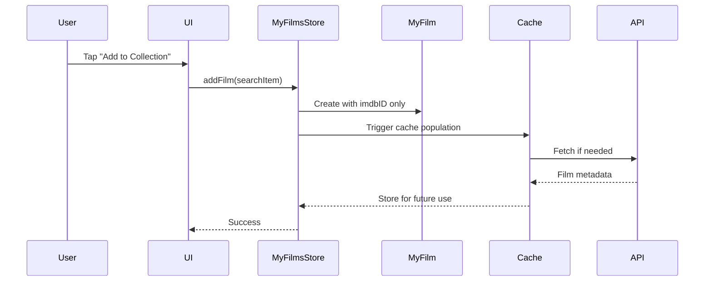
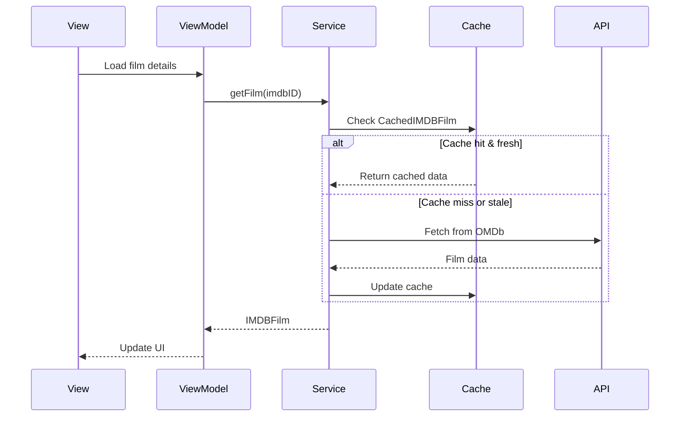

# Data Structures

A comprehensive guide to all data models, types, and structures used in the Filmz2 application.

[TOC]

## Overview

Filmz2's data layer is organized into distinct categories:

- **Persistence Models**: SwiftData models for local storage
- **API Models**: Structures for OMDb API communication
- **UI Models**: ViewModels and UI-specific data structures
- **Support Types**: Enums, protocols, and error types

## Architecture Pattern

Filmz2 uses an ID-only architecture with cached metadata:

```text
User Collection (MyFilm)          Cached Metadata (CachedIMDBFilm)
┌─────────────────────┐          ┌──────────────────────────────┐
│ imdbID: "tt0133093" │ -------> │ imdbID: "tt0133093"         │
│ myRating: 9         │          │ title: "The Matrix"          │
│ watched: true       │          │ actors: "Keanu Reeves..."    │
│ notes: "Amazing!"   │          │ plot: "A computer hacker..." │
└─────────────────────┘          │ lastFetched: 2024-01-15      │
                                 └──────────────────────────────┘
```

This pattern ensures:

- No data duplication
- Efficient storage
- Clear separation of concerns
- Future extensibility

## Persistence Models (SwiftData)

### MyFilm

The core model for user's personal film collection. Stores only the IMDB ID reference and user-specific data.

```swift
@Model
final class MyFilm {
    // Identity
    @Attribute(.unique) var id: UUID
    @Attribute(.unique) var imdbID: String

    // User Data
    var myRating: Int?
    var dateAdded: Date
    var watched: Bool
    var dateWatched: Date?
    var audience: AudienceType?
    var recommendedBy: String?
    var notes: String?
}
```

**Key Features:**

- ID-only pattern - stores just `imdbID` reference
- All user-specific data (ratings, notes, watch status)
- Convenience initializers from `IMDBFilm` and `OMDBSearchItem`
- Computed properties for display formatting

**Status**: ✅ Implemented in `Models/MyFilm.swift`

### CachedIMDBFilm

Persistent cache of film metadata from the OMDb API.

```swift
@Model
final class CachedIMDBFilm {
    @Attribute(.unique) var imdbID: String

    // Film metadata
    var title: String
    var year: String?
    var rated: String?
    var released: String?
    var runtime: String?
    var genre: String?
    var director: String?
    var writer: String?
    var actors: String?
    var plot: String?
    var language: String?
    var country: String?
    var awards: String?
    var poster: String?
    var metascore: String?
    var imdbRating: String?
    var imdbVotes: String?
    var type: String?

    // Cache metadata
    var lastFetched: Date
    var dataVersion: Int
}
```

**Key Features:**

- Complete film information storage
- 30-day freshness check via `isStale` computed property
- Conversion methods to/from `IMDBFilm`
- Version tracking for future migrations

**Status**: ✅ Implemented in `Models/CachedIMDBFilm.swift`

### User Data Enums

#### AudienceType

Represents who watched the film with the user.

```swift
enum AudienceType: String, Codable {
    case meAlone = "Me alone"
    case meAndPartner = "Me and partner"
    case family = "Family"
}
```

**Status**: ✅ Implemented in `Models/MyFilm.swift`

## API Models

### Search Models

#### OMDBSearchResponse

Raw response from OMDb API search endpoint.

```swift
struct OMDBSearchResponse: Codable {
    let search: [OMDBSearchItem]?  // Array of search results
    let totalResults: String?       // Total number of results
    let response: String           // "True" or "False"
    let error: String?             // Error message if response is "False"

    enum CodingKeys: String, CodingKey {
        case search = "Search"
        case totalResults
        case response = "Response"
        case error = "Error"
    }
}
```

#### OMDBSearchItem

Individual search result from the API.

```swift
struct OMDBSearchItem: Codable, Identifiable, Hashable {
    let title: String      // Movie title
    let year: String       // Release year
    let imdbID: String     // IMDB identifier
    let type: String       // "movie", "series", or "episode"
    let poster: String?    // Poster URL (optional)

    var id: String { imdbID }

    enum CodingKeys: String, CodingKey {
        case title = "Title"
        case year = "Year"
        case imdbID
        case type = "Type"
        case poster = "Poster"
    }
}
```

#### SearchResult

Internal structure for processed search results.

```swift
struct SearchResult {
    let films: [IMDBFilm]     // Array of film objects
    let totalResults: Int     // Total count
    let currentPage: Int      // Current page number
    let totalPages: Int       // Total pages available
}
```

### Detail Models

#### IMDBFilm

Complete film information model used throughout the app.

```swift
struct IMDBFilm: Identifiable, Codable {
    // Required fields
    let title: String
    let imdbID: String

    // Optional fields
    let year: String?
    let rated: String?
    let released: String?
    let runtime: String?
    let genre: String?
    let director: String?
    let writer: String?
    let actors: String?
    let plot: String?
    let language: String?
    let country: String?
    let awards: String?
    let poster: String?
    let ratings: [Rating]?
    let metascore: String?
    let imdbRating: String?
    let imdbVotes: String?
    let type: String?
    let response: String?

    var id: String { imdbID }
}
```

**Computed Properties:**

- `posterURL: URL?` - Converts poster string to URL
- `genreList: [String]` - Splits genres into array
- `formattedIMDBRating: String?` - Formats as "X.X/10"
- `rottenTomatoesRating: String?` - Extracts from ratings array
- `yearAndRuntime: String` - Combined display string

**Custom Decoding:**

- Treats "N/A" values as nil
- Handles missing optional fields gracefully

**Status**: ✅ Implemented in `Models/IMDBFilm.swift`

#### Rating

Rating information from various sources.

```swift
struct Rating: Codable {
    let source: String  // e.g., "Internet Movie Database"
    let value: String   // e.g., "9.0/10"

    enum CodingKeys: String, CodingKey {
        case source = "Source"
        case value = "Value"
    }
}
```

#### OMDBDetailResponse

Complete API response for film details (internal use).

```swift
struct OMDBDetailResponse: Codable {
    // Contains all fields from the API
    // Maps to IMDBFilm for app usage
}
```

## UI Models

### ViewModels

#### IMDBFilmDetailViewModel

Business logic for film detail display.

```swift
@MainActor
class IMDBFilmDetailViewModel: ObservableObject {
    @Published var film: IMDBFilm
    @Published var isImageLoading: Bool = false
    @Published var imageLoadError: Error?

    // Computed display properties
    var titleWithYear: String
    var genreChips: [String]
    var formattedActors: String?
    var directorInfo: String?
    var availableRatings: [RatingDisplayInfo]

    // Utility methods
    func formattedVotes() -> String?
    func shouldTruncatePlot(maxLength: Int) -> Bool
}
```

#### MovieSearchViewModel

Manages movie search functionality.

```swift
@MainActor
class MovieSearchViewModel: ObservableObject {
    @Published var searchQuery = ""
    @Published var searchResults: [OMDBSearchItem] = []
    @Published var isLoading = false
    @Published var errorMessage: String?
    @Published var hasSearched = false

    // Pagination
    private var currentPage = 1
    private var totalResults = 0
    var hasMoreResults: Bool

    // Methods
    func searchFilms()
    func loadMoreResults()
    func clearSearch()
}
```

#### CollectionViewModel

Manages the user's film collection display.

```swift
@MainActor
class CollectionViewModel: ObservableObject {
    @Published var filter = CollectionFilter()
    @Published var searchText = ""
    @Published var availableGenres: [String] = []
    @Published var filmDetailsCache: [String: IMDBFilm] = [:]
    @Published var films: [MyFilm] = []

    // Computed properties
    var filteredAndSortedFilms: [MyFilm]
    var totalFilmsCount: Int
    var watchedFilmsCount: Int
    var unwatchedFilmsCount: Int
}
```

### UI Support Models

#### RatingDisplayInfo

Standardizes rating display across the app.

```swift
struct RatingDisplayInfo {
    let source: String    // "IMDB", "Rotten Tomatoes", "Metacritic"
    let value: String     // Formatted rating value
    let icon: String      // SF Symbol name
    let color: Color      // Source-specific color
}
```

#### CollectionFilter

Encapsulates all filtering options for the collection view.

```swift
struct CollectionFilter: Equatable {
    var watchedStatus: WatchedFilter = .all
    var genres: Set<String> = []
    var sortOption: SortOption = .recentlyAdded
}
```

#### Navigation

##### MainTab

Defines the app's main navigation tabs.

```swift
enum MainTab: Int, CaseIterable {
    case collection = 0
    case search = 1
    case settings = 2

    var title: String {
        switch self {
        case .collection: return "Collection"
        case .search: return "Search"
        case .settings: return "Settings"
        }
    }

    var icon: String {
        switch self {
        case .collection: return "books.vertical"
        case .search: return "magnifyingglass"
        case .settings: return "gearshape"
        }
    }
}
```

**Status**: ✅ Implemented in `Models/MainTab.swift`

## Type Definitions

### Enums

#### MediaType

Types of media content from OMDb API.

```swift
enum MediaType: String {
    case movie
    case series
    case episode
}
```

#### WatchedFilter

Filter options for collection view.

```swift
enum WatchedFilter: String, CaseIterable {
    case all = "All"
    case watched = "Watched"
    case unwatched = "Unwatched"
}
```

**Status**: ✅ Implemented in `ViewModels/CollectionViewModel.swift`

#### SortOption

Sorting options for film collection.

```swift
enum SortOption: String, CaseIterable {
    case nameAscending = "Name (A-Z)"
    case nameDescending = "Name (Z-A)"
    case yearNewest = "Year (Newest)"
    case yearOldest = "Year (Oldest)"
    case recentlyAdded = "Recently Added"
    case firstAdded = "First Added"

    var systemImage: String {
        switch self {
        case .nameAscending, .yearOldest, .firstAdded:
            return "arrow.up"
        case .nameDescending, .yearNewest, .recentlyAdded:
            return "arrow.down"
        }
    }
}
```

**Status**: ✅ Implemented in `ViewModels/CollectionViewModel.swift`

## Error Handling

### OMDBError

Comprehensive error handling for API operations.

```swift
enum OMDBError: Error, LocalizedError {
    case invalidAPIKey           // API key is invalid
    case movieNotFound          // No results found
    case invalidResponse        // Malformed response
    case networkError(Error)    // Network-related errors
    case dailyLimitExceeded     // API rate limit hit
    case decodingError(Error)   // JSON decoding failed
    case unknownError(String)   // Other errors with message

    var errorDescription: String? {
        switch self {
        case .invalidAPIKey:
            return "Invalid API key. Please check your configuration."
        case .movieNotFound:
            return "Movie not found."
        case .invalidResponse:
            return "Invalid response from server."
        case .networkError(let error):
            return "Network error: \(error.localizedDescription)"
        case .dailyLimitExceeded:
            return "Daily API limit exceeded. Please try again tomorrow."
        case .decodingError(let error):
            return "Failed to decode response: \(error.localizedDescription)"
        case .unknownError(let message):
            return message
        }
    }
}
```

### MyFilmsStoreError

Errors specific to collection management.

```swift
enum MyFilmsStoreError: Error, LocalizedError {
    case filmAlreadyExists(String)  // Film title already in collection
    case saveFailed(Error)          // SwiftData save failed
    case deleteFailed(Error)        // SwiftData delete failed
    case invalidRating              // Rating outside 0-10 range

    var errorDescription: String? {
        switch self {
        case .filmAlreadyExists(let title):
            return "\(title) is already in your collection"
        case .saveFailed(let error):
            return "Failed to save: \(error.localizedDescription)"
        case .deleteFailed(let error):
            return "Failed to delete: \(error.localizedDescription)"
        case .invalidRating:
            return "Rating must be between 0 and 10"
        }
    }
}
```

## Protocols

### Service Protocols

#### OMDBSearchServiceProtocol

Defines the contract for search service implementations.

```swift
protocol OMDBSearchServiceProtocol {
    func searchFilms(query: String, year: String?, type: MediaType?, page: Int) async throws -> SearchResult
    func searchFilmsRaw(query: String, year: String?, type: MediaType?, page: Int) async throws -> OMDBSearchResponse
    func getFilm(byID: String) async throws -> IMDBFilm
    func getFilm(byTitle: String, year: String?) async throws -> IMDBFilm
    func getFilmDetails(imdbID: String) async throws -> IMDBFilm
}
```

#### URLSessionProtocol

Enables testing by abstracting URLSession.

```swift
protocol URLSessionProtocol {
    func data(from url: URL) async throws -> (Data, URLResponse)
}
```

## Data Flow

### Adding a Film to Collection



### Displaying Film Details



## Migration Notes

### Future Considerations

1. **Shows & Series**: Current implementation treats shows as single films. Future versions will need:

   - Season/Episode models
   - Hierarchical relationships
   - Different UI patterns

2. **Data Version**: `CachedIMDBFilm.dataVersion` enables future schema migrations

3. **Social Features**: ID-only pattern makes it easy to add:
   - Shared collections
   - Friend recommendations
   - Collection statistics

## Summary

The data architecture prioritizes:

- **Separation of Concerns**: User data vs. movie metadata
- **Efficiency**: No duplicate storage, smart caching
- **Flexibility**: Easy to extend without breaking changes
- **Type Safety**: Comprehensive error handling and optionals
- **Performance**: Minimal data transfer and storage
