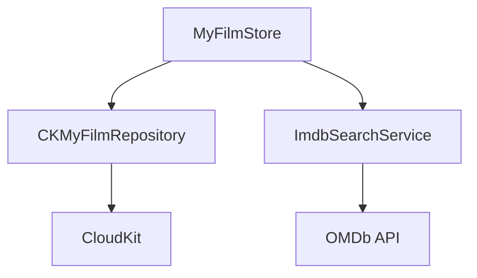
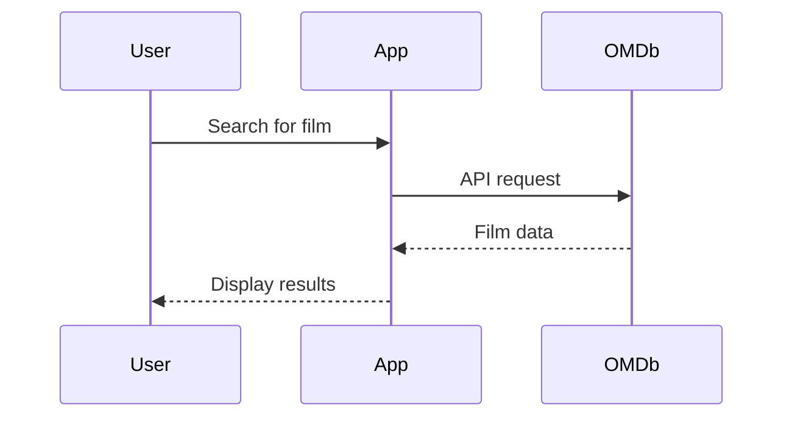
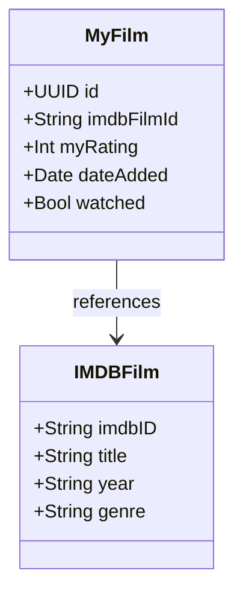
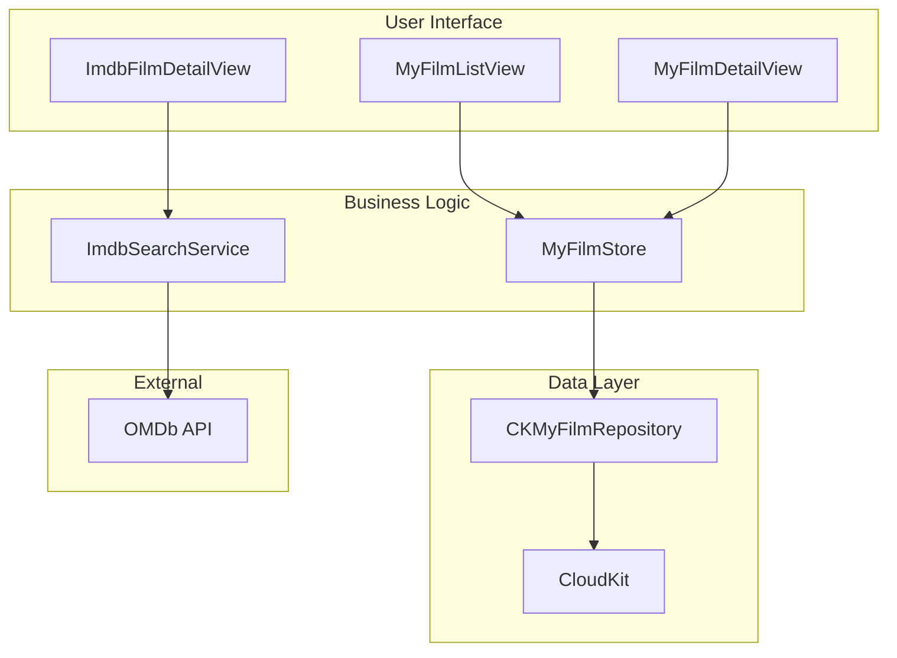
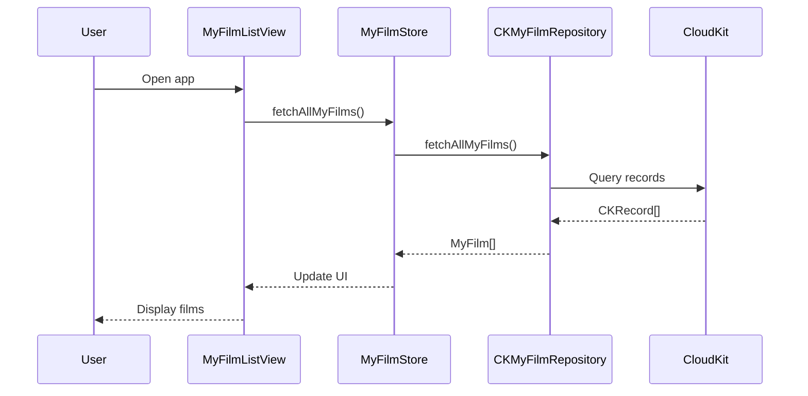

# ADR-002: Use Mermaid for Diagrams and Graphs

## Status

Accepted

## Context

The Filmz2 project needs a standardized approach for creating and maintaining technical diagrams in our documentation. These diagrams include:

- Architecture diagrams showing component relationships
- Data flow diagrams for API interactions
- Sequence diagrams for user workflows
- Entity relationship diagrams for data models
- Component hierarchy diagrams for UI structures

Key requirements for our diagramming solution:

- Version control friendly (text-based, not binary)
- Readable by both humans and AI assistants
- Supports common diagram types needed for software documentation
- Integrates well with our markdown-based documentation
- Widely supported across platforms and tools
- Easy to learn and maintain by team members

Current challenges with traditional diagramming tools:

- Binary image files are difficult to diff and merge
- External tools require additional software and licenses
- Images become outdated and hard to maintain
- AI assistants cannot easily read or suggest changes to binary diagrams
- Collaboration requires sharing and syncing separate diagram files

## Decision

We will use Mermaid as our standard diagramming solution for all technical documentation in the Filmz2 project.

Mermaid diagrams will be:

- Embedded directly in markdown files using fenced code blocks
- Used for all new diagrams in documentation
- Gradually replace existing binary diagrams as they need updates
- Required for architecture documentation and feature specifications

## Consequences

### Positive

- **Version Control Integration**: Text-based diagrams can be diffed, merged, and reviewed like code
- **AI-Friendly**: Claude and other AI assistants can read, understand, and suggest changes to Mermaid syntax
- **GitHub Native Support**: Mermaid renders automatically in GitHub markdown without additional tools
- **Documentation Co-location**: Diagrams live alongside related text in the same markdown files
- **Easy Maintenance**: Updating diagrams is as simple as editing text
- **Team Accessibility**: No specialized software required - any text editor works
- **Emerging Standard**: Growing adoption across the industry ensures long-term viability
- **Multiple Diagram Types**: Supports flowcharts, sequence diagrams, class diagrams, state diagrams, and more

### Negative

- **Learning Curve**: Team members need to learn Mermaid syntax
- **Styling Limitations**: Less visual customization compared to dedicated design tools
- **Complex Diagrams**: Very detailed diagrams might be harder to create than with visual tools
- **Rendering Dependencies**: Requires Mermaid-compatible viewers for optimal display

### Neutral

- **Tool Migration**: Existing diagrams in other formats can be gradually converted
- **Backup Options**: Can still use traditional tools for specialized cases if needed

## Implementation Guidelines

### Diagram Types and Usage

**Architecture Diagrams** - Use flowcharts for system component relationships:

**Sequence Diagrams** - For user workflows and API interactions:

**Class Diagrams** - For data model relationships:

### Best Practices

1. **Placement**: Include diagrams close to related text explanations
2. **Complexity**: Keep diagrams focused - break complex systems into multiple simpler diagrams
3. **Consistency**: Use consistent naming conventions and styles across diagrams
4. **Comments**: Add comments in Mermaid syntax to explain complex relationships
5. **Updates**: Update diagrams when code or architecture changes
6. **Testing**: Verify diagrams render correctly in GitHub and other markdown viewers

### Documentation Standards

- All new architecture documentation must include relevant Mermaid diagrams
- Feature specifications should include sequence diagrams for user flows
- Data structure documentation should include entity relationship diagrams
- Component documentation should show hierarchical relationships

### Tool Support

**Recommended Editors**:

- VSCode with Mermaid Preview extension
- GitHub web interface (native rendering)
- Any markdown editor with Mermaid plugin

**Online Tools**:

- Mermaid Live Editor for complex diagram development
- GitHub markdown preview for validation

## Migration Plan

1. **Phase 1**: All new documentation uses Mermaid diagrams
2. **Phase 2**: Update ARCHITECTURE.md with Mermaid versions of existing diagrams
3. **Phase 3**: Convert diagrams in feature documentation as they're updated
4. **Phase 4**: Add Mermaid diagrams to fill gaps in current documentation

## Examples

### Current Architecture Overview

### Data Flow Example

This ADR establishes Mermaid as our standard for creating maintainable, version-controlled, and AI-friendly technical diagrams that enhance our documentation quality and team collaboration.
