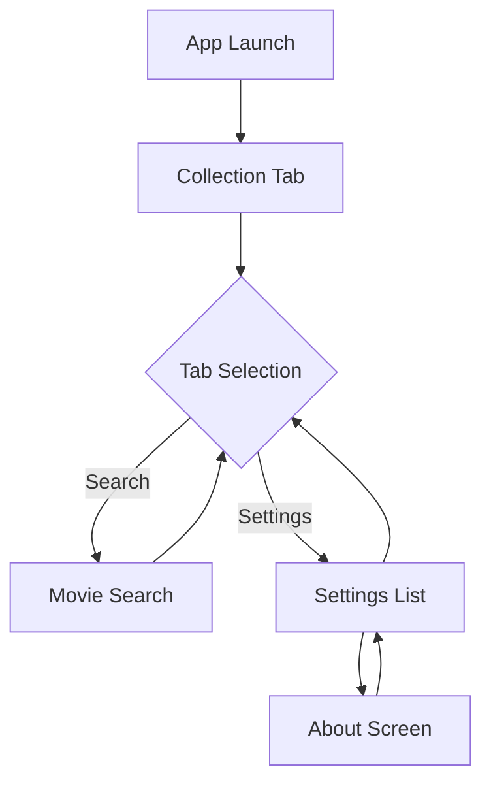

# Feature: App Navigation Structure

## Overview

Restructure the main app navigation to prioritize the user's film collection as the primary feature, with Collection, Search, and Settings as the three main navigation tabs. The Collection view should be the default landing screen when opening the app.

## User Story

**As a** film enthusiast  
**I want to** have my collection as the main focus of the app  
**So that** I can quickly access and browse my saved films when I open the app

## Acceptance Criteria

- [ ] Tab bar navigation with three tabs: Collection, Search, Settings
- [ ] Collection tab is selected by default on app launch
- [ ] Each tab has appropriate icon and label
- [ ] Navigation state persists during app session
- [ ] Settings page contains list of sub-screens
- [ ] About sub-screen implemented with app information

## Visual Design

### Layout Structure

```text
┌─────────────────────────────────┐
│        [Main Content]           │
│                                 │
│     (Collection/Search/         │
│         Settings View)          │
│                                 │
│                                 │
│                                 │
├─────────────────────────────────┤
│  📚        🔍        ⚙️         │
│Collection Search  Settings      │
└─────────────────────────────────┘
```

### UI Components

1. **Tab Bar**
   - Fixed at bottom of screen
   - Three equally-spaced tabs
   - Active tab highlighted with accent color
   - Icons with labels below

2. **Tab Icons**
   - Collection: SF Symbol "books.vertical" or similar
   - Search: SF Symbol "magnifyingglass"
   - Settings: SF Symbol "gearshape"

3. **Settings List View**
   - Standard iOS/macOS list style
   - Chevron indicators for sub-screens
   - Grouped sections as needed

4. **About Screen**
   - App name and version
   - Developer information
   - Acknowledgments/credits
   - Links to privacy policy/terms

### Design Specifications

- **Tab Bar Height**: Standard platform height
- **Icon Size**: 24pt (iOS), appropriate for macOS
- **Typography**: System font for tab labels
- **Colors**: System accent color for selected state

## Technical Implementation

### Data Models

```swift
enum MainTab: Int, CaseIterable {
    case collection = 0
    case search = 1
    case settings = 2
    
    var title: String {
        switch self {
        case .collection: return "Collection"
        case .search: return "Search"
        case .settings: return "Settings"
        }
    }
    
    var icon: String {
        switch self {
        case .collection: return "books.vertical"
        case .search: return "magnifyingglass"
        case .settings: return "gearshape"
        }
    }
}
```

### Architecture

- **Main View**: `ContentView.swift` (update to use TabView)
- **Settings View**: `SettingsView.swift`
- **About View**: `AboutView.swift`
- **Navigation State**: Use `@State` or `@StateObject` for tab selection

### Implementation Details

Update `ContentView.swift`:

```swift
struct ContentView: View {
    @State private var selectedTab: MainTab = .collection
    
    var body: some View {
        TabView(selection: $selectedTab) {
            CollectionView()
                .tabItem {
                    Label(MainTab.collection.title, 
                          systemImage: MainTab.collection.icon)
                }
                .tag(MainTab.collection)
            
            MovieSearchView()
                .tabItem {
                    Label(MainTab.search.title, 
                          systemImage: MainTab.search.icon)
                }
                .tag(MainTab.search)
            
            SettingsView()
                .tabItem {
                    Label(MainTab.settings.title, 
                          systemImage: MainTab.settings.icon)
                }
                .tag(MainTab.settings)
        }
    }
}
```

### Dependencies

- [ ] SwiftUI TabView component
- [ ] Existing CollectionView
- [ ] Existing MovieSearchView
- [ ] New SettingsView and AboutView

## User Flow

1. User launches app → Collection tab displayed
2. User taps Search tab → Navigate to movie search
3. User taps Settings tab → Show settings list
4. User taps About in settings → Navigate to About screen
5. User taps back → Return to settings list



## Edge Cases

1. **State Restoration**
   - Scenario: App returns from background
   - Expected behavior: Maintain previously selected tab

2. **Deep Linking**
   - Scenario: Opening app from notification/URL
   - Expected behavior: Navigate to appropriate tab/screen

3. **Orientation Changes**
   - Scenario: Device rotation
   - Expected behavior: Tab bar adjusts appropriately

## Testing Requirements

### Unit Tests

- [ ] Test tab selection state management
- [ ] Test navigation between tabs
- [ ] Test settings list data source

### UI Tests

- [ ] Test default tab on launch is Collection
- [ ] Test tab switching functionality
- [ ] Test navigation to About screen
- [ ] Test back navigation from sub-screens

## Accessibility

- [ ] Tab bar items have descriptive accessibility labels
- [ ] VoiceOver announces current tab
- [ ] Tab switching works with VoiceOver gestures
- [ ] Settings list items are properly labeled

## Performance Considerations

- **Loading**: Lazy load tab content views
- **Memory**: Release unused view controllers when switching tabs
- **State**: Minimize state transfers between tabs

## Security Considerations

- [ ] Settings should not expose sensitive information
- [ ] About screen links open in appropriate browser

## Analytics

Track the following events:

- [ ] `tab_switched`: When user changes tabs (include from/to)
- [ ] `settings_opened`: When settings tab selected
- [ ] `about_viewed`: When About screen opened

## Future Enhancements

- [ ] Customizable tab order
- [ ] Additional tabs (e.g., Statistics, Social)
- [ ] Tab badges for notifications
- [ ] Gesture-based tab switching

## Definition of Done

- [ ] Tab navigation implemented with Collection as default
- [ ] All three tabs functional with correct icons/labels
- [ ] Settings screen with working About sub-screen
- [ ] Navigation works on both iOS and macOS
- [ ] Unit and UI tests passing
- [ ] Accessibility verified
- [ ] Analytics events implemented

## References

- [Apple HIG - Tab Bars](https://developer.apple.com/design/human-interface-guidelines/tab-bars)
- [SwiftUI TabView Documentation](https://developer.apple.com/documentation/swiftui/tabview)

---

**Status**: Draft  
**Created**: 2025-06-02  
**Updated**: 2025-06-02  
**Author**: Claude