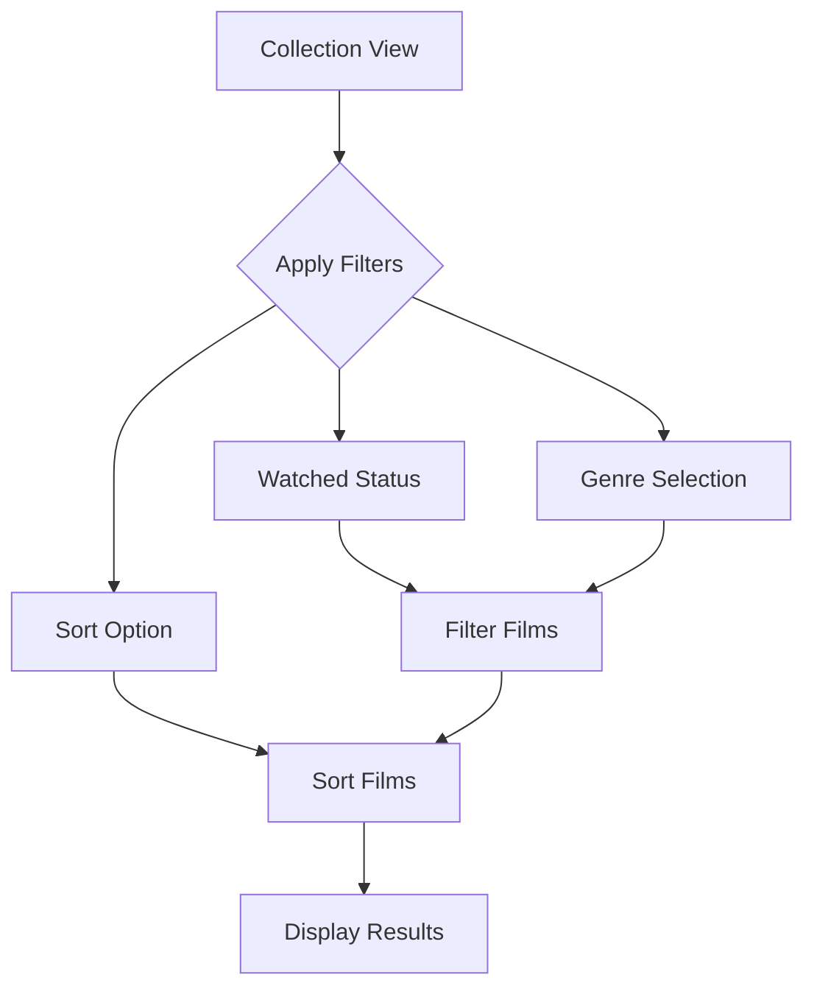

# Feature: Collection View Enhancements

## Overview

Enhance the Collection View with advanced filtering and sorting capabilities, and display genre pills directly in the list view for better visual organization and quick film identification.

## User Story

**As a** film collector  
**I want to** filter and sort my collection in various ways  
**So that** I can quickly find specific films and organize my collection according to my preferences

## Acceptance Criteria

- [ ] Genre filter added to existing All/Watched/Unwatched filters
- [ ] Sort options for: Name (A-Z, Z-A), Year (newest/oldest), Date Added (newest/oldest)
- [ ] Genre pills displayed in each film row in the list
- [ ] Filter and sort selections persist during session
- [ ] Smooth animations when applying filters/sorts
- [ ] Clear indication of active filters and sort order

## Visual Design

### Layout Structure

```text
┌─────────────────────────────────┐
│  My Collection                  │
├─────────────────────────────────┤
│ [All][Watched][Unwatched]       │
│ Genre: [All Genres ▼] Sort: [▼]│
├─────────────────────────────────┤
│ ┌─────────────────────────────┐ │
│ │ 🎬 The Matrix (1999)        │ │
│ │ [Sci-Fi][Action][Thriller]  │ │
│ └─────────────────────────────┘ │
│ ┌─────────────────────────────┐ │
│ │ 🎬 Inception (2010)         │ │
│ │ [Sci-Fi][Action][Mystery]   │ │
│ └─────────────────────────────┘ │
└─────────────────────────────────┘
```

### UI Components

1. **Genre Filter Dropdown**
   - Positioned below existing tab filters
   - Shows "All Genres" by default
   - Dropdown lists all genres from user's collection
   - Multi-select capability for combining genres

2. **Sort Options Menu**
   - Dropdown or segmented control
   - Options: Name (A-Z), Name (Z-A), Year (Newest), Year (Oldest), Recently Added, First Added
   - Icon indicates current sort direction

3. **Genre Pills in List**
   - Compact pills showing up to 3 genres
   - Consistent with genre pill component styling
   - Truncate with "..." if more than 3 genres

### Design Specifications

- **Filter Bar Height**: 44pt
- **Genre Pill Size**: Small variant (as defined in GenrePill component)
- **Spacing**: 8pt between filter controls
- **Animation**: 0.3s ease-in-out for filter/sort transitions

## Technical Implementation

### Data Models

```swift
enum SortOption: String, CaseIterable {
    case nameAscending = "Name (A-Z)"
    case nameDescending = "Name (Z-A)"
    case yearNewest = "Year (Newest)"
    case yearOldest = "Year (Oldest)"
    case recentlyAdded = "Recently Added"
    case firstAdded = "First Added"
    
    var keyPath: KeyPath<MyFilm, some Comparable> {
        // Implementation details
    }
    
    var ascending: Bool {
        // Return sort direction
    }
}

struct CollectionFilter {
    var watchedStatus: WatchedFilter = .all
    var genres: Set<String> = []
    var sortOption: SortOption = .recentlyAdded
}
```

### Architecture

- **View**: Update `CollectionView.swift`
- **ViewModel**: Create `CollectionViewModel.swift` for filter/sort logic
- **Components**: Reuse existing `GenrePills.swift`

### Implementation Details

```swift
// In CollectionViewModel
func filteredAndSortedFilms() -> [MyFilm] {
    var films = allFilms
    
    // Apply watched filter
    if filter.watchedStatus != .all {
        films = films.filter { /* watched logic */ }
    }
    
    // Apply genre filter
    if !filter.genres.isEmpty {
        films = films.filter { film in
            // Check if film has any selected genre
        }
    }
    
    // Apply sort
    films.sort { /* sort logic based on sortOption */ }
    
    return films
}
```

### Dependencies

- [ ] Existing GenrePills component
- [ ] MyFilmsStore for collection data
- [ ] CachedIMDBFilm for genre information

## User Flow

1. User opens Collection tab → sees all films sorted by recently added
2. User taps genre filter → dropdown shows available genres
3. User selects "Action" → list updates to show only action films
4. User changes sort to "Year (Newest)" → films reorder by release year
5. User taps "Watched" tab → filter combines with genre filter



## Edge Cases

1. **No Genres Available**
   - Scenario: Films in collection have no genre data
   - Expected behavior: Hide genre filter or show "No genres available"

2. **Empty Results**
   - Scenario: Filter combination returns no films
   - Expected behavior: Show empty state with option to clear filters

3. **Large Genre List**
   - Scenario: Collection has 20+ unique genres
   - Expected behavior: Scrollable dropdown with search capability

## Testing Requirements

### Unit Tests

- [ ] Test filter logic for each filter type
- [ ] Test sort algorithms for each option
- [ ] Test filter combination logic
- [ ] Test genre extraction from films

### UI Tests

- [ ] Test filter dropdown interactions
- [ ] Test sort option selection
- [ ] Test filter persistence during navigation
- [ ] Test empty state scenarios

### Test Data

```swift
static let testFilms = [
    MyFilm(imdbID: "tt0133093"), // The Matrix - Sci-Fi, Action
    MyFilm(imdbID: "tt0111161"), // Shawshank - Drama
    MyFilm(imdbID: "tt1375666"), // Inception - Sci-Fi, Action
]
```

## Accessibility

- [ ] Filter controls accessible via VoiceOver
- [ ] Sort order announced when changed
- [ ] Genre pills in list have appropriate labels
- [ ] Keyboard navigation for filter controls

## Performance Considerations

- **Filtering**: Perform on background queue for large collections
- **Caching**: Cache genre list to avoid repeated calculations
- **Animations**: Disable for large result sets (>100 films)
- **Lazy Loading**: Use LazyVStack for film list

## Security Considerations

- [ ] Filter selections stored locally only
- [ ] No sensitive data exposed in filters

## Analytics

Track the following events:

- [ ] `filter_applied`: Genre filter used (include genre count)
- [ ] `sort_changed`: Sort option selected (include option)
- [ ] `filter_cleared`: User clears all filters
- [ ] `empty_results`: Filter combination yields no results

## Future Enhancements

- [ ] Save filter presets
- [ ] Additional filters (rating ranges, year ranges)
- [ ] Quick filter buttons for common genres
- [ ] Search within filtered results
- [ ] Export filtered list

## Definition of Done

- [ ] All filter and sort options implemented
- [ ] Genre pills displayed in collection list
- [ ] Smooth animations for all transitions
- [ ] Empty states handled gracefully
- [ ] Unit and UI tests passing
- [ ] Performance acceptable for 1000+ films
- [ ] Accessibility verified
- [ ] Analytics events implemented

## References

- Existing components: `GenrePills.swift`, `CollectionView.swift`
- Design inspiration: iOS Music app genre filtering

---

**Status**: Draft  
**Created**: 2025-06-02  
**Updated**: 2025-06-02  
**Author**: Claude