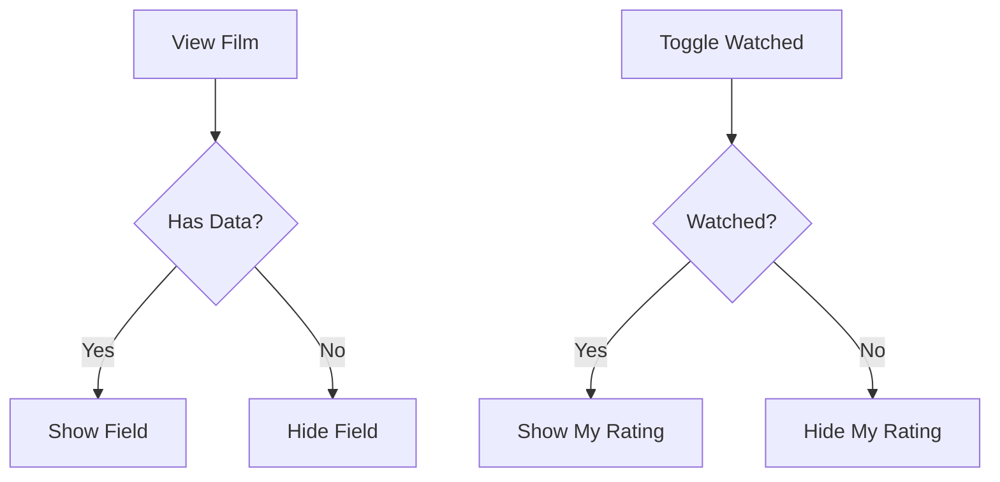

# Feature: MyFilm View UI Improvements

## Overview

Improve the MyFilmDetailView UI by implementing conditional field visibility, smart section management, and better organization of user-specific data fields. Fields without data should not display their labels, and "My Rating" should only appear when the film is marked as watched.

## User Story

**As a** user viewing my film details  
**I want to** see only relevant information without empty fields  
**So that** the interface is clean and focuses on available data

## Acceptance Criteria

- [ ] "My Rating" field only visible when "Watched" is true
- [ ] Empty fields and their labels are completely hidden
- [ ] "My Notes" field grouped with other "My Data" fields
- [ ] No "N/A" text displayed anywhere - fields are hidden instead
- [ ] Components updated to work in both MyFilmDetailView and IMDBFilmDetailView
- [ ] Smooth transitions when toggling watched status

## Visual Design

### Layout Structure

```text
When Watched = false:
┌─────────────────────────────────┐
│ [Film Poster and Title Section] │
├─────────────────────────────────┤
│ Film Information                │
│ Director: Christopher Nolan     │
│ Runtime: 148 min               │
│ (No empty fields shown)        │
├─────────────────────────────────┤
│ My Data                        │
│ ☐ Watched                      │
│ Audience: Solo                 │
│ Recommended by: John           │
│ My Notes: [text field]         │
│ (My Rating is hidden)          │
└─────────────────────────────────┘

When Watched = true:
┌─────────────────────────────────┐
│ [Film Poster and Title Section] │
├─────────────────────────────────┤
│ Film Information                │
│ Director: Christopher Nolan     │
│ Runtime: 148 min               │
├─────────────────────────────────┤
│ My Data                        │
│ ☑ Watched on Oct 15, 2024      │
│ My Rating: ❤️ 8/10             │
│ Audience: Solo                 │
│ Recommended by: John           │
│ My Notes: [text field]         │
└─────────────────────────────────┘
```

### UI Components

1. **Conditional Field Display**
   - Each field checks for non-nil, non-empty data
   - Label and value hidden together when empty
   - No placeholder text or "N/A" values

2. **My Rating Visibility**
   - Appears with slide animation when watched toggled on
   - Disappears when watched toggled off
   - Maintains any existing rating value

3. **My Notes Field**
   - Moved to "My Data" section
   - Multi-line text editor
   - Placeholder: "Add your notes..."

### Design Specifications

- **Section Spacing**: 16pt between sections
- **Field Spacing**: 12pt between fields within sections
- **Animation**: 0.3s ease-in-out for field appearance/disappearance
- **Text**: System font, secondary color for labels

## Technical Implementation

### Updated Components

Update `FilmInfoRow.swift`:
```swift
struct FilmInfoRow: View {
    let label: String
    let value: String?
    
    var body: some View {
        if let value = value, !value.isEmpty, value != "N/A" {
            HStack {
                Text(label)
                    .foregroundColor(.secondary)
                Spacer()
                Text(value)
            }
        }
    }
}
```

Update `FilmMetadataSection.swift`:
```swift
struct FilmMetadataSection: View {
    let film: IMDBFilm
    
    var body: some View {
        VStack(alignment: .leading, spacing: 12) {
            // Only show fields with data
            FilmInfoRow(label: "Director", value: film.director)
            FilmInfoRow(label: "Writers", value: film.writer)
            FilmInfoRow(label: "Runtime", value: film.runtime)
            // etc...
        }
    }
}
```

### MyFilmDetailView Updates

```swift
// In My Data section
VStack(alignment: .leading, spacing: 12) {
    // Watched toggle
    Toggle("Watched", isOn: $viewModel.film.watched)
    
    // Conditional My Rating
    if viewModel.film.watched {
        HStack {
            Text("My Rating")
                .foregroundColor(.secondary)
            Spacer()
            // Rating picker
        }
        .transition(.move(edge: .top).combined(with: .opacity))
    }
    
    // Other fields only if they have data
    if let audience = viewModel.film.audience {
        FilmInfoRow(label: "Audience", value: audience.rawValue)
    }
    
    if let recommendedBy = viewModel.film.recommendedBy,
       !recommendedBy.isEmpty {
        FilmInfoRow(label: "Recommended by", value: recommendedBy)
    }
    
    // My Notes field (always visible)
    VStack(alignment: .leading) {
        Text("My Notes")
            .foregroundColor(.secondary)
        TextEditor(text: $viewModel.film.notes ?? "")
            .frame(minHeight: 80)
    }
}
.animation(.easeInOut, value: viewModel.film.watched)
```

### Dependencies

- [ ] Updated FilmInfoRow component
- [ ] Updated FilmMetadataSection component
- [ ] MyFilm model with conditional binding support

## User Flow

1. User views unwatched film → "My Rating" field not visible
2. User toggles "Watched" on → "My Rating" field slides in
3. User sets rating → Rating saved but hidden if watched toggled off
4. User views film with no director → Director field not displayed
5. User adds notes → Notes always visible in My Data section



## Edge Cases

1. **Rating Without Watched**
   - Scenario: User had rating, then unchecks watched
   - Expected behavior: Rating hidden but value preserved

2. **All Fields Empty**
   - Scenario: Film has minimal metadata
   - Expected behavior: Sections with no fields are hidden

3. **Long Notes**
   - Scenario: User enters very long notes
   - Expected behavior: Text editor expands, scrollable if needed

## Testing Requirements

### Unit Tests

- [ ] Test conditional field visibility logic
- [ ] Test My Rating visibility based on watched status
- [ ] Test empty string and "N/A" filtering
- [ ] Test section visibility with no fields

### UI Tests

- [ ] Test watched toggle shows/hides rating
- [ ] Test empty fields don't appear
- [ ] Test notes field in My Data section
- [ ] Test animation of rating field appearance

## Accessibility

- [ ] Hidden fields not announced by VoiceOver
- [ ] Proper labels for all visible fields
- [ ] Focus management when fields appear/disappear
- [ ] Text editor accessible for notes

## Performance Considerations

- **Conditional Rendering**: Use SwiftUI's built-in optimization
- **Animation**: Disable for reduce motion preference
- **Layout**: Minimize view rebuilds with proper state management

## Security Considerations

- [ ] User data changes saved locally only
- [ ] No sensitive data exposed in hidden fields

## Analytics

Track the following events:

- [ ] `rating_visibility_changed`: When rating shown/hidden
- [ ] `notes_edited`: When user adds/edits notes
- [ ] `empty_fields_hidden`: Count of hidden fields per view

## Future Enhancements

- [ ] Customizable field visibility preferences
- [ ] Additional conditional fields based on genre
- [ ] Auto-save for notes with draft indicator
- [ ] Rich text formatting for notes

## Definition of Done

- [ ] All empty fields and labels hidden
- [ ] My Rating only visible when watched is true
- [ ] My Notes moved to My Data section
- [ ] Components work in both detail views
- [ ] Smooth animations for field visibility
- [ ] Unit and UI tests passing
- [ ] No "N/A" text anywhere in UI
- [ ] Accessibility verified

## References

- Components: `FilmInfoRow.swift`, `FilmMetadataSection.swift`
- Views: `MyFilmDetailView.swift`, `IMDBFilmDetailView.swift`

---

**Status**: Draft  
**Created**: 2025-06-02  
**Updated**: 2025-06-02  
**Author**: Claude