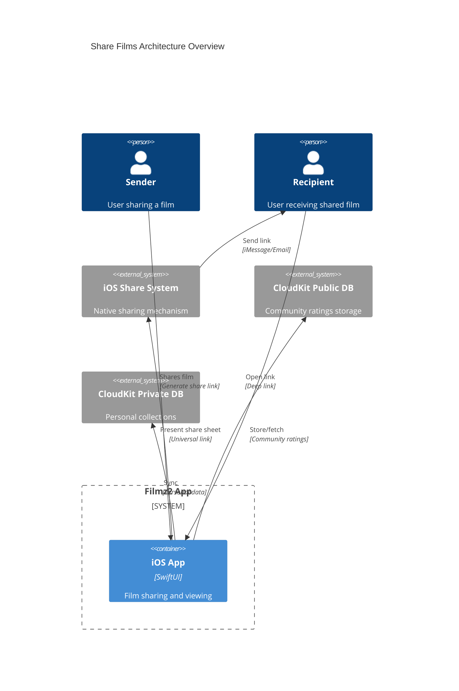
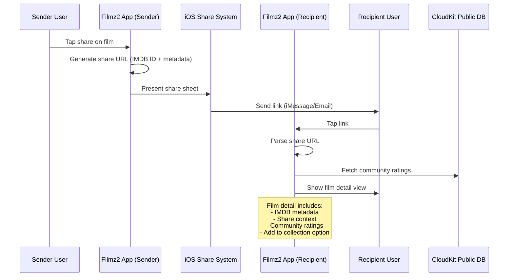
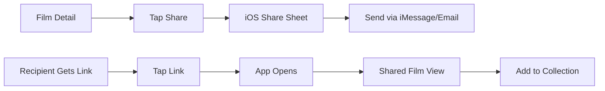

# Share Films Feature - Architectural Draft

## Overview

This document outlines the architectural approach for implementing the share-films feature in Filmz2. Users can share film recommendations via standard iOS sharing mechanisms, with recipients opening shared films directly in the app.

## Requirements Summary

1. **Sharing**: User taps share → iOS share sheet → Send link via iMessage/email
2. **Receiving**: Recipient taps link → App opens film detail view
3. **Content**: IMDB metadata + Personal "My Data" + Community "Filmz Rating"
4. **Attribution**: Optional comments and sender identification

## Architectural Strategy

### Core Approach: Deep Linking + Community Ratings

### Key Principles

1. **Leverage Existing Architecture**: Uses ID-only pattern and cached metadata
2. **Standard iOS Integration**: Native sharing and deep linking
3. **Optional Social Layer**: Community ratings without personal data sharing

## Architecture Components

### Data Flow

### Key Data Models

1. **ShareableFilm**: Lightweight data transfer object encoded in share URLs
2. **FilmzRating**: Community ratings stored in CloudKit Public Database
3. **Enhanced MyFilm**: Existing model extended with share attribution fields

### Core Services

1. **FilmSharingService**: Handles URL generation, share sheet presentation, and deep link parsing
2. **FilmzRatingService**: Manages community ratings in CloudKit Public Database
3. **Enhanced OMDBSearchService**: Extended to include community rating fetching

### UI Components

#### Enhanced Views

1. **Film Detail Views**: Add share button and community rating display
2. **SharedFilmDetailView**: Special view for received shared films with context
3. **ShareContextSection**: Shows sender info, comments, and attribution
4. **CommunityRatingSection**: Displays aggregate Filmz ratings

#### User Experience Flow

## Technical Requirements

### Deep Linking

- **Universal Links**: Configure `applinks:filmz2.app` domain
- **URL Structure**: `https://filmz2.app/share/{encoded-film-data}`
- **App Integration**: Handle incoming links and parse share data

### CloudKit Configuration

- **Public Database**: Store anonymous community ratings
- **Privacy**: Users control rating visibility and comment sharing
- **Security**: Rate limiting and spam prevention

### URL Format

Share URLs encode film metadata as base64 JSON containing:

- IMDB ID (required)
- Sender name (optional)
- Comments (optional)
- Share date and rating (optional)

## Implementation Phases

### Phase 1: Basic Sharing (MVP)

- Universal link setup and deep link handling
- Share URL generation and parsing
- Basic shared film detail view
- Add to collection functionality

### Phase 2: Community Features

- CloudKit public database for ratings
- Community rating display and submission
- Enhanced sharing with comments and attribution

### Phase 3: Enhanced Experience

- Share analytics and history
- Advanced UI components
- Performance optimizations

## Summary

This architecture enables film sharing while preserving Filmz2's core privacy and simplicity principles:

### Key Benefits

- **Privacy First**: Personal collections remain private, community features are opt-in
- **Seamless Integration**: Uses standard iOS sharing and existing app architecture
- **Incremental Rollout**: Can be implemented in phases with MVP first
- **Low Complexity**: Avoids complex CloudKit sharing in favor of simpler deep linking

### Architecture Highlights

- **Deep Linking**: Universal links for cross-app film sharing
- **Community Ratings**: Optional public database for aggregate film ratings
- **Existing Pattern Reuse**: Leverages ID-only architecture and cached metadata
- **Native iOS Experience**: Standard share sheets and deep link handling

The design balances social features with user privacy, enabling film recommendations while maintaining control over personal data.
