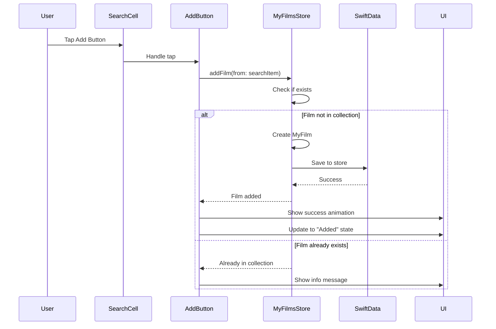

# Feature: Add Films to Collection from Search Results

## Overview

Allow users to add films directly from search results to their personal collection, enabling them to build and manage their movie watchlist and viewing history.

## User Story

As a movie enthusiast, I want to add films from search results to my collection so that I can track movies I want to watch and movies I've already seen.

## Requirements

### Functional Requirements

1. **Add to Collection Button**
   - Display an "Add" button/icon on each search result cell
   - Show visual feedback when a film is already in the collection
   - Provide immediate visual confirmation when adding

2. **Quick Add Flow**
   - One-tap to add film to collection with default values
   - Film is added as "unwatched" by default
   - Capture current date as "dateAdded"
   - Store IMDB ID for linking to film details

3. **Collection State Indicators**
   - Search results show if film is already in collection
   - Different visual states: "Add" vs "In Collection"
   - Optional: Show watch status (watched/unwatched)

4. **Data Persistence**
   - Save film to local SwiftData store
   - Create MyFilm record with IMDBFilm data
   - Maintain relationship between MyFilm and IMDB ID

### Technical Requirements

1. **MyFilm Model Implementation**
   - Complete the MyFilm SwiftData model
   - Link to IMDBFilm via imdbID
   - Store user-specific metadata

2. **MyFilmsStore Service**
   - CRUD operations for MyFilm entities
   - Check if film exists in collection
   - Batch operations for performance

3. **UI Components**
   - AddToCollectionButton component
   - Collection status indicator
   - Success/error feedback

## User Interface

### Search Result Cell Enhancement

```
┌─────────────────────────────────────────────┐
│ [Poster] Title (Year)                    [+]│
│          Type • Runtime              [Added]│
└─────────────────────────────────────────────┘
```

- **[+]** - Add button (when not in collection)
- **[Added]** - Status indicator (when in collection)

### Add Button States

1. **Default**: Plus icon, blue color
2. **Loading**: Progress indicator
3. **Success**: Checkmark animation
4. **In Collection**: Checkmark, gray color
5. **Error**: Exclamation, red color

## Data Flow



## Implementation Steps

### Phase 1: Core Functionality
1. Complete MyFilm SwiftData model
2. Implement MyFilmsStore service
3. Add collection checking to search results
4. Create AddToCollectionButton component

### Phase 2: Enhanced UX
1. Add success animations
2. Implement haptic feedback
3. Add undo functionality
4. Show collection count badge

### Phase 3: Advanced Features
1. Quick edit options (rating, watched status)
2. Bulk add from search results
3. Collection sync across devices
4. Duplicate handling

## MyFilm Model Structure

```swift
@Model
class MyFilm {
    // Identity
    let id: UUID
    let imdbID: String
    
    // User Data
    var myRating: Int?
    var dateAdded: Date
    var watched: Bool
    var dateWatched: Date?
    var audience: AudienceType?
    var recommendedBy: String?
    var notes: String?
    
    // Cached Film Data
    var title: String
    var year: String?
    var posterURL: String?
    var genres: [String]
    
    // Relationships
    var tags: [Tag]?
    var lists: [MovieList]?
}
```

## Success Metrics

1. **Adoption Rate**: % of users who add at least one film
2. **Collection Growth**: Average films added per user
3. **Engagement**: Return rate to collection tab
4. **Performance**: Add operation < 100ms

## Edge Cases

1. **Offline Mode**: Queue additions for sync
2. **Duplicate Prevention**: Handle same film added twice
3. **Data Migration**: Support future schema changes
4. **Large Collections**: Optimize for 1000+ films

## Future Enhancements

1. **Smart Recommendations**: "Users who added this also added..."
2. **Social Features**: Share collections with friends
3. **Import/Export**: Letterboxd, IMDB lists
4. **Advanced Filtering**: By genre, year, rating in collection

## Dependencies

- SwiftData framework
- MyFilmsStore service (to be implemented)
- Collection tab UI (to be enhanced)
- Sync service (future)

## Acceptance Criteria

- [ ] User can tap to add any search result to collection
- [ ] Visual feedback shows add operation status
- [ ] Search results indicate films already in collection
- [ ] Films appear immediately in Collection tab
- [ ] Data persists between app launches
- [ ] Performance remains smooth with large collections
- [ ] Error states are handled gracefully