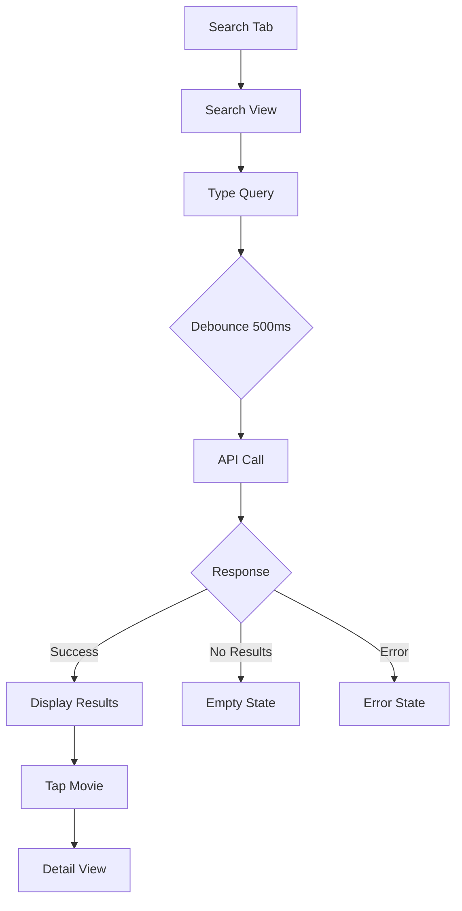

# Feature: Movie Search

## Overview

A search interface that allows users to find movies by entering a title or partial title. The feature implements **wide search** functionality, meaning partial matches are included in results - searching for "bat" will return movies like "Batman", "Batman Begins", "Batwoman", etc. The feature queries the OMDb API and displays results in a scrollable list with movie posters, titles, years, and basic metadata. Users can tap on any result to view detailed information about that movie.

## User Story

**As a** Filmz2 user  
**I want to** search for movies by title  
**So that** I can find specific movies to learn more about them and potentially add them to my collection.

## Acceptance Criteria

- [x] User can enter text in a search field
- [x] Search executes after user stops typing (debounced)
- [ ] **Wide search**: Partial matches are included (e.g., "bat" returns "Batman", "Combat", "Acrobat")
- [ ] Results display in a scrollable list
- [ ] Each result shows poster, title, year, and type
- [ ] Loading state displays while searching
- [ ] Empty state shows when no results found
- [ ] Error state handles API failures gracefully
- [ ] User can tap a result to navigate to detail view
- [ ] Search persists when returning from detail view
- [ ] Keyboard dismisses on scroll

## Visual Design

### Layout Structure

```text
┌─────────────────────────┐
│   🔍 Search Movies      │
│   [Search Input Field]  │
└─────────────────────────┘
┌─────────────────────────┐
│   Search Results        │
├─────────────────────────┤
│ ┌─────┬───────────────┐ │
│ │ 🎬  │ Movie Title   │ │
│ │     │ (Year) • Type │ │
│ └─────┴───────────────┘ │
│ ┌─────┬───────────────┐ │
│ │ 🎬  │ Movie Title   │ │
│ │     │ (Year) • Type │ │
│ └─────┴───────────────┘ │
│          ...            │
└─────────────────────────┘
```

### UI Components

1. **Search Bar**
   - Prominent placement at top
   - Placeholder text: "Search movies..."
   - Clear button when text present
   - Auto-capitalization off
   - Return key type: "Search"

2. **Result Cell**
   - Poster thumbnail (60x90pt)
   - Title (headline font, 2 lines max)
   - Year and type (caption font, secondary color)
   - Chevron indicator for navigation
   - Divider between cells

3. **Loading State**
   - Centered progress spinner
   - "Searching..." text below spinner

4. **Empty State**
   - Centered SF Symbol (magnifyingglass)
   - "No movies found" message
   - Suggestion to try different keywords

### Design Specifications

- **Color Scheme**:
  - Primary: System blue for interactive elements
  - Background: System background colors
  - Text: Label colors for proper contrast
- **Typography**:
  - Search field: Body
  - Movie title: Headline
  - Metadata: Caption
- **Spacing**:
  - Cell padding: 12pt
  - Section spacing: 16pt
- **Animations**:
  - Fade in/out for results
  - Smooth scroll performance

## Search Behavior

### Wide Search Implementation

The movie search feature implements **wide search** (also known as partial matching), which means:

1. **Partial Title Matching**: Searching for "bat" will return all movies containing "bat" anywhere in the title:
   - "Batman" (starts with search term)
   - "Batman Begins" (starts with search term)
   - "Batwoman" (starts with search term)
   - "Combat" (contains search term)
   - "Acrobat" (ends with search term)

2. **Case-Insensitive**: Searches are case-insensitive, so "BAT", "Bat", and "bat" all return the same results.

3. **Word Boundaries**: The search does not require word boundaries, so:
   - "man" returns "Batman", "Superman", "Iron Man", "Woman in Gold"
   - "the" returns "The Dark Knight", "In the Mood for Love", "The Matrix"

4. **Special Characters**: The search handles special characters appropriately:
   - Searching for "mission:" returns "Mission: Impossible" films
   - Searching for "&" returns films with "&" in the title

### Search Examples

| Search Query | Example Results |
|-------------|-----------------|
| "bat" | Batman, Batman Begins, Batman Returns, Batwoman |
| "batm" | Batman, Batman Begins, Batman Returns |
| "man" | Batman, Superman, Iron Man, The Man from U.N.C.L.E. |
| "star" | Star Wars, Star Trek, A Star is Born, Stardust |
| "star wars" | Star Wars films (Episode I-IX, Rogue One, etc.) |
| "mission:" | Mission: Impossible series |

### API Behavior

The OMDb API supports wide search through its `s` parameter with wildcard support:

- **Minimum query length**: 3 characters required (e.g., "ba" is too short, "bat" works)
- The service automatically appends a `*` wildcard to all search queries
- This enables partial matching (e.g., "batm" finds "Batman")
- If the user manually includes a `*`, no additional wildcard is added
- Results are ranked by relevance with best matches first
- For queries under 3 characters, the UI shows "Keep typing..." message

### Implementation Details

The `OMDBSearchService` validates and modifies search queries before sending to the API:

```swift
// OMDb API requires at least 3 characters for search
guard query.count >= 3 || query.hasSuffix("*") else {
    // Return empty result for queries that are too short
    return SearchResult(films: [], totalResults: 0, currentPage: page, totalPages: 0)
}

// Add wildcard for wide search if query doesn't already end with *
let searchQuery = query.hasSuffix("*") ? query : query + "*"
```

This ensures:

1. Queries must be at least 3 characters long
2. Partial searches like "batm" will find "Batman", "Batman Begins", etc.
3. Short queries (1-2 characters) return empty results immediately

## Technical Implementation

### Data Models

- **SearchResult**: See [OMDBSearchService.swift](../../filmz2/Services/OMDBSearchService.swift#L15-L20)
- **IMDBFilm**: See [IMDBFilm.swift](../../filmz2/Models/IMDBFilm.swift#L6-L36)
- **MediaType**: See [OMDBSearchService.swift](../../filmz2/Services/OMDBSearchService.swift#L9-L13)

### API Requirements

- **Service**: [`OMDBSearchService`](../../filmz2/Services/OMDBSearchService.swift)
  - **Protocol**: [`OMDBSearchServiceProtocol`](../../filmz2/Services/OMDBSearchService.swift#L3-L7)
  - **Method**: `searchFilms(query:year:type:page:)` - [Line 49](../../filmz2/Services/OMDBSearchService.swift#L49)
  - **Error Handling**: [`OMDBError`](../../filmz2/Services/OMDBSearchService.swift#L22-L36)
- **Debounce**: 500ms after typing stops
- **Pagination**: Load more on scroll to bottom

### Architecture

- **View**: `MovieSearchView.swift` (to be created)
- **ViewModel**: `MovieSearchViewModel.swift` (to be created)
- **Reuses**:
  - [`OMDBSearchService`](../../filmz2/Services/OMDBSearchService.swift)
  - [`IMDBFilm`](../../filmz2/Models/IMDBFilm.swift) model
  - [`IMDBFilmDetailView`](../../filmz2/Views/IMDBFilmDetailView.swift) for navigation
  - [`IMDBFilmDetailViewModel`](../../filmz2/ViewModels/IMDBFilmDetailViewModel.swift)

### Dependencies

- [x] OMDBSearchService (already implemented)
- [x] IMDBFilm model (already implemented)
- [ ] Combine framework for debouncing
- [ ] SwiftUI navigation

## User Flow

1. User taps search tab/button
2. Search view appears with keyboard
3. User types movie title
4. After 500ms pause, search executes
5. Results appear below search bar
6. User scrolls through results
7. User taps a movie
8. Navigation to IMDBFilmDetailView



## Edge Cases

1. **No Network Connection**
   - Scenario: User searches without internet
   - Expected behavior: Show error with retry button

2. **API Rate Limit**
   - Scenario: 1000 daily limit exceeded
   - Expected behavior: Cache results, show appropriate message

3. **Special Characters**
   - Scenario: User enters ":", "&", or other special chars
   - Expected behavior: Properly encode for API

4. **Very Long Queries**
   - Scenario: User pastes long text
   - Expected behavior: Truncate to reasonable length

## Testing Requirements

### Unit Tests

- [ ] Test search query debouncing
- [ ] Test API error handling
- [ ] Test result mapping
- [ ] Test pagination logic
- [ ] Test search state management
- [ ] **Test wide search behavior**:
  - [ ] Test partial match at start ("bat" finds "Batman")
  - [ ] Test partial match in middle ("bat" finds "Combat")
  - [ ] Test partial match at end ("bat" finds "Acrobat")
  - [ ] Test case-insensitive search ("BAT" finds "Batman")
  - [ ] Test special character search (":" finds "Mission: Impossible")

### UI Tests

- [ ] Test search input and keyboard
- [ ] Test result cell rendering
- [ ] Test navigation to detail
- [ ] Test pull to refresh
- [ ] Test empty/error states
- [ ] **Test wide search UI behavior**:
  - [ ] Verify partial search returns multiple matching results
  - [ ] Verify results are displayed correctly for wide matches
  - [ ] Test that tapping any wide search result navigates correctly

### Test Data

- Use existing test data from [IMDBFilm.swift](../../filmz2/Models/IMDBFilm.swift#L241-L327):
  - `IMDBFilm.sampleFilms`
  - `IMDBFilm.darkKnight`
  - `IMDBFilm.inception`
  - `IMDBFilm.minimalFilm`

## Accessibility

- [ ] VoiceOver labels for all interactive elements
- [ ] Search field announces state changes
- [ ] Results announce count
- [ ] Error messages are announced
- [ ] Sufficient color contrast

## Performance Considerations

- **Loading**: Async image loading with placeholders
- **Caching**: Cache recent searches (last 10)
- **Memory**: Limit results in memory (50 max)
- **Network**: Cancel previous request on new search

## Security Considerations

- [ ] Sanitize search input
- [ ] No sensitive data in search history
- [ ] API key stored securely

## Analytics

Track the following events:

- [ ] `search_initiated`: When user starts typing
- [ ] `search_performed`: When API call is made
- [ ] `search_result_tapped`: When user selects a movie
- [ ] `search_error`: When search fails

## Future Enhancements

- [ ] Search filters (year, type, genre)
- [ ] Search history/suggestions
- [ ] Voice search
- [ ] Barcode scanning for physical media

## Definition of Done

- [ ] Code implemented following MVVM pattern
- [ ] Unit tests written and passing (>80% coverage)
- [ ] UI tests implemented
- [ ] Code reviewed and approved
- [ ] Documentation updated
- [ ] Accessibility verified with VoiceOver
- [ ] Performance tested with large result sets
- [ ] Works on iPhone and iPad
- [ ] No memory leaks verified

## References

- [OMDb API Search Documentation](https://www.omdbapi.com/#parameters)
- [Apple HIG - Search](https://developer.apple.com/design/human-interface-guidelines/search)
- [SwiftUI Search Tutorial](https://developer.apple.com/documentation/swiftui/adding-search-to-your-app)
