# Feature: Consistent Ratings Display

## Overview

Implement a unified rating display system across the entire app using consistent components and visual indicators. Each rating type (IMDB, Rotten Tomatoes, My Rating) will have its own distinct icon and formatting to ensure immediate recognition and visual consistency.

## User Story

**As a** user browsing films  
**I want to** immediately recognize different rating types by their icons  
**So that** I can quickly understand and compare ratings across different sources

## Acceptance Criteria

- [x] IMDB ratings display with yellow star (★) and format "★ 7.5/10"
- [x] Rotten Tomatoes ratings display with tomato icon and percentage
- [x] My ratings display with red heart (❤️) and format "❤️ 7.5/10"
- [x] Consistent components used everywhere ratings appear
- [x] Proper alignment and spacing across all views
- [x] Icons render correctly on all platforms (iOS/iPadOS/macOS)

## Visual Design

### Rating Display Formats

```text
IMDB Rating:      ★ 7.5/10 (the star in yellow)
Rotten Tomatoes:  🍅 85%
My Rating:        ❤️ 8/10

In a row:
★ 7.5/10  🍅 85%  ❤️ 8/10
```

### UI Components

1. **IMDBRatingView**
   - Yellow star icon (SF Symbol or emoji)
   - Format: "X.X/10"
   - Gray color if no rating available

2. **RottenTomatoesRatingView**
   - Tomato emoji or custom icon
   - Format: "XX%"
   - Fresh/Rotten visual indication if needed

3. **MyRatingView**
   - Red heart emoji
   - Format: "X/10" (integer)
   - Only shown when user has rated

4. **RatingsRow**
   - Horizontal stack of all available ratings
   - Consistent spacing between ratings
   - Wrap to new line on small screens

### Design Specifications

- **Icon Size**: 14pt (matches text size)
- **Text Style**: System body font
- **Spacing**: 4pt between icon and value, 16pt between ratings
- **Colors**:
  - IMDB: System yellow for star
  - Rotten Tomatoes: Red/Green based on score
  - My Rating: System red for heart

## Technical Implementation

### Rating Components

```swift
// IMDBRatingView.swift
struct IMDBRatingView: View {
    let rating: String?
    
    var body: some View {
        if let rating = rating, rating != "N/A" {
            Label(rating, systemImage: "star.fill")
                .foregroundColor(.yellow)
                .labelStyle(CustomRatingLabelStyle())
        }
    }
}

// RottenTomatoesRatingView.swift
struct RottenTomatoesRatingView: View {
    let rating: String?
    
    var body: some View {
        if let rating = rating, rating != "N/A" {
            HStack(spacing: 4) {
                Text("🍅")
                Text(rating)
            }
            .foregroundColor(ratingColor(for: rating))
        }
    }
    
    private func ratingColor(for rating: String) -> Color {
        // Return red/green based on percentage
    }
}

// MyRatingView.swift
struct MyRatingView: View {
    let rating: Int?
    
    var body: some View {
        if let rating = rating {
            HStack(spacing: 4) {
                Text("❤️")
                Text("\(rating)/10")
            }
        }
    }
}

// RatingsRow.swift
struct RatingsRow: View {
    let imdbRating: String?
    let rottenTomatoesRating: String?
    let myRating: Int?
    
    var body: some View {
        HStack(spacing: 16) {
            IMDBRatingView(rating: imdbRating)
            RottenTomatoesRatingView(rating: rottenTomatoesRating)
            MyRatingView(rating: myRating)
        }
    }
}
```

### Custom Label Style

```swift
struct CustomRatingLabelStyle: LabelStyle {
    func makeBody(configuration: Configuration) -> some View {
        HStack(spacing: 4) {
            configuration.icon
            configuration.title
        }
    }
}
```

### Integration Points

Update all views that display ratings:

- `MovieSearchResultCell.swift`
- `IMDBFilmDetailView.swift`
- `MyFilmDetailView.swift`
- `CollectionView.swift` (list items)

### Dependencies

- [ ] SF Symbols for star icon
- [ ] Emoji support for tomato and heart
- [ ] Existing rating data from models

## User Flow

1. User searches for films → Sees IMDB ratings in results
2. User views film detail → Sees all available ratings in row
3. User adds film to collection → Can add their rating
4. User browses collection → Sees their ratings alongside IMDB ratings

```mermaid
graph TD
    A[Film Data] --> B{Has IMDB Rating?}
    B -->|Yes| C[Show ★ X.X/10]
    B -->|No| D[Hide IMDB Rating]
    
    A --> E{Has RT Rating?}
    E -->|Yes| F[Show 🍅 XX%]
    E -->|No| G[Hide RT Rating]
    
    A --> H{Has My Rating?}
    H -->|Yes| I[Show ❤️ X/10]
    H -->|No| J[Hide My Rating]
```



## Edge Cases

1. **Missing Ratings**
   - Scenario: Film has no ratings from any source
   - Expected behavior: Show no ratings row at all

2. **Platform Emoji Support**
   - Scenario: Older devices may not support certain emojis
   - Expected behavior: Fallback to text ("RT:", "My:")

3. **Long Rating Values**
   - Scenario: Unusual rating format from API
   - Expected behavior: Truncate or reformat as needed

## Testing Requirements

### Unit Tests

- [ ] Test each rating component with valid data
- [ ] Test components with nil/empty data
- [ ] Test rating color logic for Rotten Tomatoes
- [ ] Test RatingsRow with various combinations

### UI Tests

- [ ] Verify correct icons display
- [ ] Test layout on different screen sizes
- [ ] Verify colors are correct
- [ ] Test accessibility labels

### Visual Tests

- [ ] Screenshot tests for each rating component
- [ ] Test on light and dark modes
- [ ] Verify emoji rendering on all platforms

## Accessibility

- [ ] Proper accessibility labels (e.g., "IMDB rating: 7.5 out of 10")
- [ ] Icons have text alternatives
- [ ] Sufficient color contrast
- [ ] VoiceOver reads ratings clearly

## Performance Considerations

- **Rendering**: Cache formatted strings
- **Icons**: Use system icons where possible
- **Layout**: Minimize view complexity

## Security Considerations

- [ ] Validate rating values before display
- [ ] Sanitize any user-provided ratings

## Analytics

Track the following events:

- [ ] `rating_displayed`: Which types of ratings shown
- [ ] `rating_tapped`: If ratings are interactive
- [ ] `missing_rating`: Track films without ratings

## Future Enhancements

- [ ] Metacritic and other rating sources
- [ ] Interactive rating components (tap to rate)
- [ ] Rating trends over time
- [ ] Average rating across sources
- [ ] Custom rating scale preferences

## Definition of Done

- [x] All rating components created and styled
- [x] Consistent display across all views
- [x] Proper icon/emoji rendering verified
- [x] Components handle nil/missing data gracefully
- [x] Unit and visual tests passing
- [x] Accessibility verified
- [x] Performance acceptable
- [x] Documentation updated

## References

- [SF Symbols](https://developer.apple.com/sf-symbols/)
- Existing rating data in models
- Material Design rating guidelines for inspiration

---

**Status**: Completed  
**Created**: 2025-06-02  
**Updated**: 2025-06-02  
**Author**: Claude  
**Implemented**: 2025-06-02
