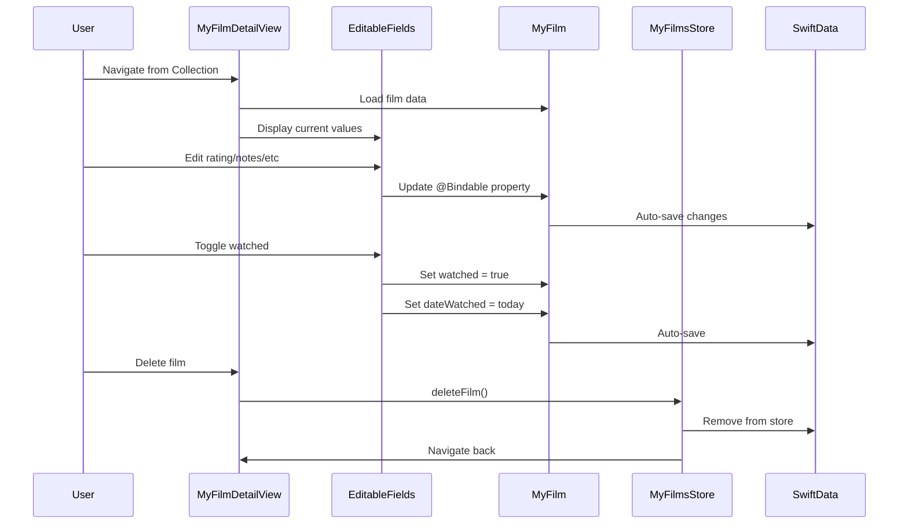

# Feature: Complete MyFilm Detail View with Editing

## Overview

Enhance the MyFilmDetailView to display all film information and provide editing capabilities for user-specific data. This view should reuse components from IMDBFilmDetailView for consistency while adding interactive elements for managing personal film data.

## User Story

As a movie enthusiast, I want to view all details of films in my collection and edit my personal data (rating, watch status, notes) so that I can track my movie-watching experience and preferences.

## Requirements

### Functional Requirements

1. **Display Requirements**
   - Show all cached film data (poster, title, year, genres, plot, etc.)
   - Display user-specific data (rating, watch status, notes, audience)
   - Reuse existing UI components from IMDBFilmDetailView
   - Maintain visual consistency with the rest of the app

2. **Editing Capabilities**
   - Toggle watched/unwatched status
   - Set watch date with date picker
   - Rate film (0-10 stars)
   - Select audience type (Me alone, Me and partner, Family)
   - Add/edit personal notes
   - Edit "recommended by" field
   - Auto-save changes

3. **Shared Components**
   - Extract common film display components for reuse
   - Create FilmPosterSection component
   - Create FilmMetadataSection component
   - Create FilmPlotSection component
   - Ensure components work with both IMDBFilm and MyFilm

### Technical Requirements

1. **Component Architecture**
   - Create shared components in Components/Film/
   - Use protocols or generics for film data compatibility
   - Maintain single source of truth for layouts

2. **State Management**
   - Use @Bindable for MyFilm editing
   - Implement auto-save with SwiftData
   - Handle edit mode transitions smoothly

3. **UI Consistency**
   - Match IMDBFilmDetailView layout structure
   - Use same spacing, fonts, and colors
   - Maintain platform compatibility (iOS/macOS)

## User Interface

### Layout Structure

```
┌─────────────────────────────────────────────┐
│              [Film Poster]                  │
│                                             │
│ Title                              Year     │
│ [Runtime] • [Rated]                         │
│                                             │
│ ──────────── User Data ────────────         │
│                                             │
│ Watch Status: [✓] Watched                   │
│ Date Watched: [Date Picker]                 │
│                                             │
│ My Rating: [★★★★★★★☆☆☆]                    │
│                                             │
│ Audience: [Selector: Me/Partner/Family]     │
│                                             │
│ Recommended by: [Text Field]                │
│                                             │
│ ──────────── Film Info ────────────         │
│                                             │
│ [Genres Pills]                              │
│                                             │
│ Director: Name                              │
│ Starring: Actor1, Actor2, Actor3            │
│                                             │
│ [Plot Text - Expandable]                    │
│                                             │
│ ──────────── My Notes ─────────────         │
│                                             │
│ [Text Editor for personal notes]            │
│                                             │
│ [Delete from Collection] button             │
└─────────────────────────────────────────────┘
```

### Interactive Elements

1. **Watch Status Toggle**
   - Switch or checkbox for watched status
   - When toggled on, show date picker
   - Auto-set today's date when first marked watched

2. **Rating Component**
   - Interactive star rating (tap to rate)
   - Show numeric value (e.g., "7/10")
   - Allow clearing rating

3. **Audience Selector**
   - Segmented control or picker
   - Options: "Me alone", "Me and partner", "Family"
   - Optional - can be unset

4. **Notes Editor**
   - Multi-line text editor
   - Placeholder: "Add your thoughts..."
   - Auto-expanding height

## Shared Components Design

### FilmPosterSection

```swift
struct FilmPosterSection: View {
    let posterURL: URL?
    let title: String
    // Reusable poster display logic
}
```

### FilmInfoRow

```swift
struct FilmInfoRow: View {
    let title: String
    let content: String
    // Consistent info row layout
}
```

### FilmMetadataSection

```swift
struct FilmMetadataSection: View {
    let year: String?
    let runtime: String?
    let rated: String?
    let director: String?
    let actors: [String]
    // Shared metadata display
}
```

### ExpandablePlot

```swift
struct ExpandablePlot: View {
    let plot: String
    @State private var isExpanded = false
    // Reusable expandable text
}
```

## Implementation Steps

### Phase 1: Extract Shared Components

1. Identify common UI elements in IMDBFilmDetailView
2. Create shared components with generic/protocol support
3. Refactor IMDBFilmDetailView to use shared components
4. Test that IMDBFilmDetailView still works correctly

### Phase 2: Build MyFilmDetailView

1. Create view structure using shared components
2. Add user data display sections
3. Implement basic navigation from CollectionView
4. Ensure proper data binding with MyFilm

### Phase 3: Add Editing Features

1. Implement watch status toggle with date picker
2. Create interactive rating component
3. Add audience selector
4. Implement notes editor
5. Add "recommended by" field

### Phase 4: Polish & Testing

1. Add delete from collection functionality
2. Implement auto-save behavior
3. Add loading/saving states
4. Test on both iOS and macOS
5. Add haptic feedback for interactions

## Data Flow



## Edge Cases

1. **Missing Film Data**: Handle films added from search with minimal data
2. **Date Validation**: Ensure watch date isn't in the future
3. **Rating Bounds**: Enforce 0-10 rating range
4. **Delete Confirmation**: Show alert before deletion
5. **Unsaved Changes**: Auto-save prevents data loss

## Success Metrics

1. **Code Reuse**: >60% of display code shared with IMDBFilmDetailView
2. **User Engagement**: Users edit at least one field in 50% of films
3. **Performance**: Edits save in <100ms
4. **Platform Parity**: All features work on iOS and macOS

## Acceptance Criteria

- [ ] All film data from MyFilm model is displayed
- [ ] Shared components are extracted and reused
- [ ] Watch status can be toggled with date selection
- [ ] Rating can be set interactively (0-10 stars)
- [ ] Audience type can be selected
- [ ] Notes can be added/edited with multi-line support
- [ ] "Recommended by" field is editable
- [ ] Changes auto-save without explicit save button
- [ ] Delete from collection works with confirmation
- [ ] View works on both iOS and macOS
- [ ] Navigation from CollectionView works properly
- [ ] Loading states are shown appropriately
- [ ] Error states are handled gracefully
