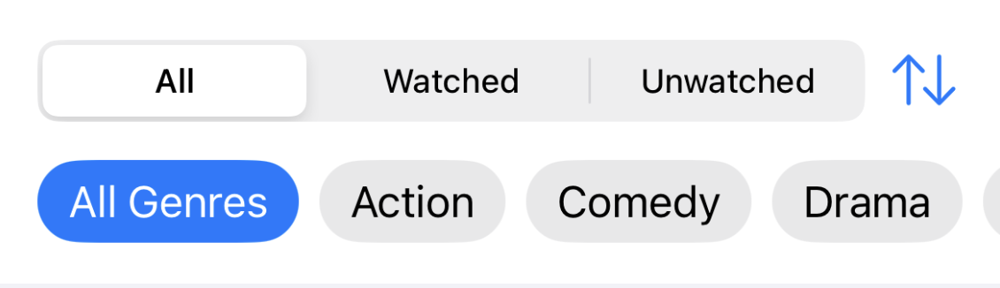

Some thoughts and whishes on specific screens.

## My Collection List

When looking at the MyCollection view, some things that should change are:

The **big title** "My Collection" takes up a lot of space w/o additional information. As a user I see where I am at the bottom menu. The "Search" view also doesn't have this title and it works fine.

**Genre filter & sorting** In the old version of filmz the part of the screen with genre filters and sort option looked cleaner and simpler:

Pls follow this, while keeping the search field above and the numbers behind the status tabs (i.e. "All (42)").
